# Persona Engine — Architecture & Design Document

A psychologically-grounded conversational persona system that creates behaviorally coherent synthetic humans for testing, research, and simulation.

**Version**: 0.2.0 | **Test Suite**: 1,899 tests passing, 0 mypy errors

---

## What Is This?

Persona Engine makes AI conversations feel like talking to a **real person** — not just any person, but a *specific* person with defined psychology, values, expertise, biases, and memories.

It does this by generating a structured **Intermediate Representation (IR)** — a complete blueprint for *how* to respond — before any text is written. This makes persona behavior **testable, debuggable, and deterministic** without ever needing to call an LLM.

---

## System Overview

```mermaid
graph TB
    subgraph "Client Layer"
        A[Client Application]
        CLI["CLI Tool<br/>python -m persona_engine"]
        C[Python SDK]
    end

    subgraph "Core SDK"
        PE[PersonaEngine]
        CONV[Conversation]
        PB[PersonaBuilder]
    end

    subgraph "Core Engine"
        subgraph "Behavioral Interpreters"
            F[Trait Interpreter<br/>Big 5 → Behavior]
            G[Values Interpreter<br/>Schwartz Values]
            H[Cognitive Interpreter<br/>Decision Style]
            I[State Manager<br/>Mood/Fatigue/Stress]
            BS[Bias Simulator<br/>Confirmation/Negativity/Authority]
            UR[Uncertainty Resolver<br/>Central Authority]
        end

        subgraph "Turn Planner"
            TP[Turn Planner<br/>5-Stage Pipeline]
            TC[TraceContext<br/>Citations + Safety]
            IA[Intent Analyzer]
            SG[Stance Generator]
            DD[Domain Detection]
            DR[Domain Registry<br/>12 Built-in Domains]
            EC[Engine Config]
        end

        subgraph "Memory"
            SC[Stance Cache]
            MM[Memory Manager]
            FS[Fact Store<br/>cap: 500]
            PS[Preference Store<br/>cap: 100]
            RS[Relationship Store<br/>cap: 50]
            ES[Episodic Store<br/>cap: 200]
        end
    end

    subgraph "Output"
        IR[Intermediate<br/>Representation]
        subgraph "Validation Engine"
            PV[Pipeline Validator]
            IRC[IR Coherence]
            PC[Persona Compliance]
            CTT[Cross-Turn Tracker]
            IRV[IR Validator]
            KBE[Knowledge Boundary<br/>Enforcer]
            SDD[Style Drift<br/>Detector]
        end
        RG[Response Generator<br/>4 Backends]
        SM[Style Modulator]
    end

    A --> PE
    CLI --> PE
    C --> PE
    PE --> CONV
    PB --> PE
    PE --> TP
    TP --> F & G & H & I & BS & UR
    TP --> TC & IA & SG & DD & DR & EC
    TP --> SC & MM
    MM --> FS & PS & RS & ES
    TP --> IR
    IR --> PV
    PV --> IRC & PC & CTT
    IR --> RG
    RG --> SM

    style PE fill:#4A90E2,color:#fff
    style TP fill:#7ED321,color:#fff
    style IR fill:#F5A623,color:#fff
    style TC fill:#BD10E0,color:#fff
    style MM fill:#50E3C2,color:#fff
    style PV fill:#E74C3C,color:#fff
```

### The Core Pipeline

```
User Input
    │
    ▼
PersonaEngine.chat()
    │
    ├─ 1. Input Validation (sanitize, length check, control char strip)
    │
    ├─ 2. TurnPlanner.generate_ir() — 5-stage canonical pipeline
    │      Stage 1: Foundation (TraceContext, seed, memory context)
    │      Stage 2: Interpretation (topic relevance, bias, state, intent, domain)
    │      Stage 3: Behavioral Metrics (elasticity, stance, confidence, tone, verbosity)
    │      Stage 4: Knowledge & Safety (disclosure, uncertainty, claim type, invariants)
    │      Stage 5: Finalization (memory writes, IR assembly, stance cache)
    │
    ├─ 3. PipelineValidator.validate() — 3-layer validation
    │      Layer 1: IR Coherence (8 rules)
    │      Layer 2: Persona Compliance (5 checks, 4 error-severity)
    │      Layer 3: Cross-Turn Consistency (swing, claim, stance)
    │
    ├─ 4. ResponseGenerator.generate() — IR → natural language
    │      Template (free) | Mock (testing) | Anthropic | OpenAI
    │
    └─ 5. ChatResult (text + IR + validation + metadata)
```

---

## Table of Contents

1. [Core SDK Layer](#1-core-sdk-layer)
2. [Schema & Data Models](#2-schema--data-models)
3. [Turn Planner Engine](#3-turn-planner-engine)
4. [Behavioral Interpreters Engine](#4-behavioral-interpreters-engine)
5. [Memory System Engine](#5-memory-system-engine)
6. [Response Generation Engine](#6-response-generation-engine)
7. [Validation Engine](#7-validation-engine)
8. [Key Design Principles](#8-key-design-principles)
9. [Module Map](#9-module-map)

---

## 1. Core SDK Layer

### 1.1 Overview

The Core SDK Layer is the public-facing surface of the Persona Engine. It collapses a multi-stage pipeline (persona loading, IR planning, LLM generation, validation, memory management) into a single object with two primary methods: `chat()` and `plan()`.

| Module | Role |
|---|---|
| `engine.py` | `PersonaEngine` class and `ChatResult` dataclass |
| `conversation.py` | `Conversation` wrapper for multi-turn sessions |
| `persona_builder.py` | `PersonaBuilder` fluent builder + `from_description` parser |
| `exceptions.py` | Typed exception hierarchy |
| `__init__.py` | Public API surface (20 symbols) |
| `__main__.py` | CLI tool with 5 subcommands |

### 1.2 PersonaEngine

The central orchestrator. Owns instances of every internal subsystem.

```python
PersonaEngine.__init__(
    persona: Persona,
    *,
    llm_provider: str = "anthropic",
    adapter: BaseLLMAdapter | None = None,
    seed: int = 42,
    validate: bool = True,
    strict_mode: bool = False,
    conversation_id: str | None = None,
)
```

**Internal components:**

| Component | Type | Purpose |
|---|---|---|
| `_determinism` | `DeterminismManager` | Seed-based reproducibility |
| `_stance_cache` | `StanceCache` | Shared mutable cache for topic stance consistency |
| `_memory` | `MemoryManager` | Facts, preferences, relationships, episodes |
| `_planner` | `TurnPlanner` | Converts user input + persona into IR |
| `_validator` | `PipelineValidator` | Coherence, compliance, cross-turn validation |
| `_generator` | `ResponseGenerator` | LLM adapter + prompt template |

**Construction paths:**

| Method | Mechanism |
|---|---|
| `from_yaml(path)` | Load YAML → `Persona` → `PersonaEngine` |
| `from_description(text)` | Heuristic NL parsing → `PersonaBuilder` → `Persona` → `PersonaEngine` |
| `load(state_path, persona_path)` | Restore serialized session (conversation_id, memory stores, turn count) |

**Data flow through `chat()`:**

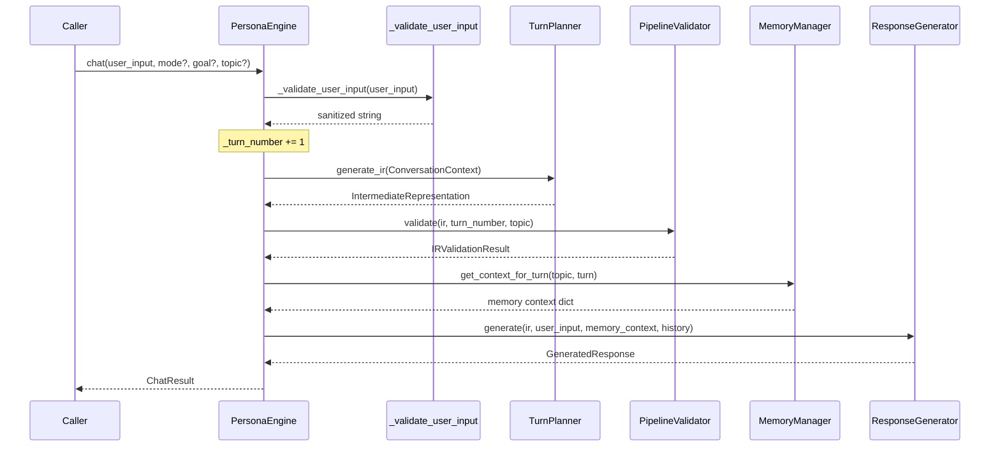

### 1.3 Conversation

Thin ergonomic wrapper around `PersonaEngine`. Adds iteration protocol, batch messaging, and export.

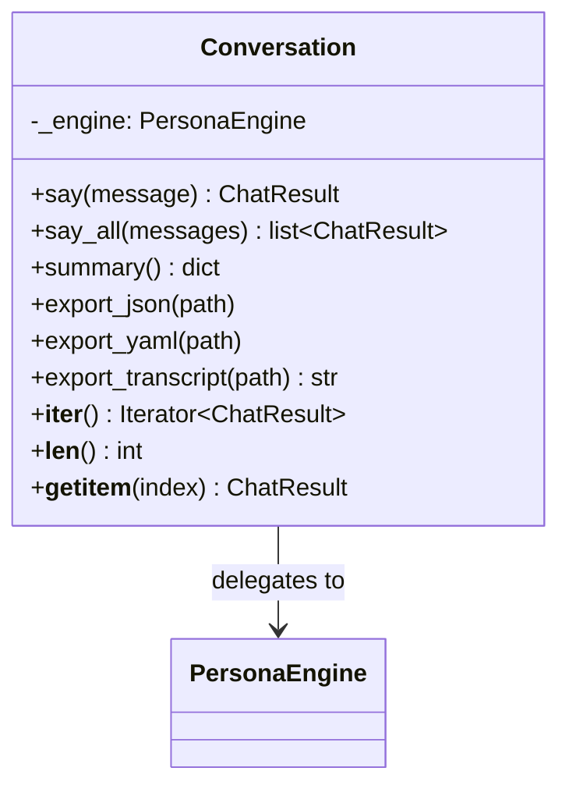

### 1.4 PersonaBuilder

Solves the cold-start problem: creating a valid `Persona` requires ~50 fields. The builder provides sensible defaults for everything.

```python
persona = (
    PersonaBuilder("Marcus", "Chef")
    .age(41)
    .location("Chicago, IL")
    .traits("passionate", "direct", "opinionated")
    .archetype("expert")
    .build()
)
```

- **30+ personality adjectives** mapped to Big Five deltas via `TRAIT_MODIFIERS`
- **6 archetypes** (expert, coach, creative, analyst, caregiver, leader)
- **58 occupation → domain mappings** for automatic knowledge domain inference
- **`from_description(text)`** uses regex-based extraction (no LLM) for name, occupation, age, location, adjectives

### 1.5 Exception Hierarchy

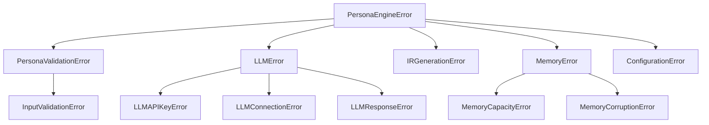

### 1.6 CLI Tool

Invoked via `python -m persona_engine`:

| Command | Description |
|---|---|
| `validate file [--deep]` | Validate persona YAML; `--deep` runs `engine.plan()` |
| `info file` | Display identity, traits, values, domains, invariants |
| `plan file message [--json]` | Generate IR without LLM call |
| `chat file message [--backend]` | Full pipeline chat |
| `list [directory]` | Scan for persona YAML files |

### 1.7 Public API

`__init__.py` exports 20 symbols across four groups:

- **Core SDK**: `PersonaEngine`, `Conversation`, `PersonaBuilder`, `ChatResult`
- **Persona Schema**: `Persona`, `PersonalityProfile`, `BigFiveTraits`, `SchwartzValues`, `CognitiveStyle`, `CommunicationPreferences`, `DomainKnowledge`, `Goal`
- **IR Schema**: `IntermediateRepresentation`, `ConversationFrame`, `ResponseStructure`, `CommunicationStyle`, `KnowledgeAndDisclosure`
- **IR Enums**: `InteractionMode`, `ConversationGoal`, `Tone`, `Verbosity`, `UncertaintyAction`

---

## 2. Schema & Data Models

### 2.1 Design Philosophy

- **Pydantic v2 BaseModel** everywhere — automatic JSON/YAML serialization, runtime validation, `Field` constraints
- **Data-only** — no runtime objects or engine dependencies in schema modules
- **Bounded numeric dimensions** — all traits/knobs are `float [0, 1]` (or `[-1, 1]` for bipolar)
- **StrEnum controlled vocabularies** — type-safe and JSON-serializable
- **Delta-based traceability** — `Citation` records before/after/delta for every planner decision

### 2.2 Persona Model Hierarchy

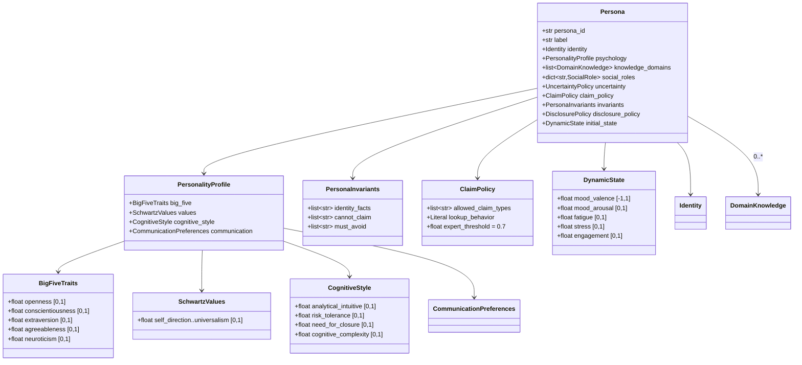

### 2.3 IR Model Hierarchy

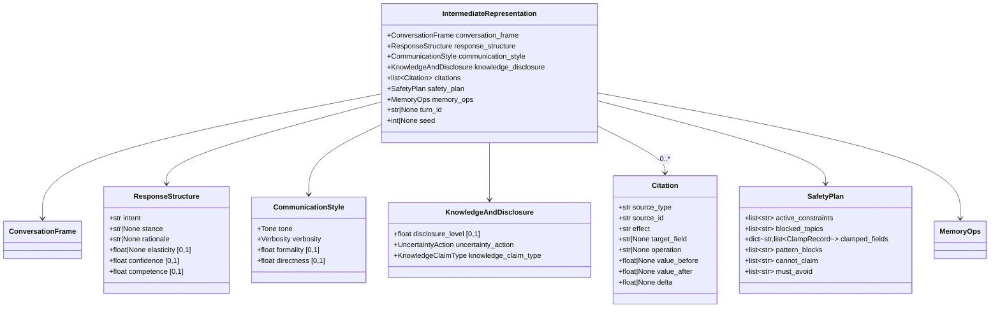

### 2.4 Enums

| Enum | Values |
|---|---|
| **Tone** (26) | `warm_enthusiastic`, `excited_engaged`, `thoughtful_engaged`, `warm_confident`, `friendly_relaxed`, `content_calm`, `satisfied_peaceful`, `neutral_calm`, `professional_composed`, `matter_of_fact`, `frustrated_tense`, `anxious_stressed`, `defensive_agitated`, `concerned_empathetic`, `disappointed_resigned`, `sad_subdued`, `tired_withdrawn`, `eager_anticipatory`, `amused_playful`, `curious_intrigued`, `surprised_caught_off_guard`, `contemptuous_dismissive`, `confused_uncertain`, `guarded_wary`, `grieving_sorrowful`, `nostalgic_wistful` |
| **InteractionMode** (15) | `casual_chat`, `interview`, `customer_support`, `survey`, `coaching`, `debate`, `small_talk`, `brainstorm`, `therapy_counseling`, `negotiation`, `storytelling`, `venting`, `teaching`, `mediation`, `confession` |
| **ConversationGoal** (13) | `gather_info`, `resolve_issue`, `build_rapport`, `persuade`, `educate`, `entertain`, `explore_ideas`, `emotional_release`, `seek_validation`, `display_status`, `reconcile`, `avoid_engage`, `commiserate` |
| **Verbosity** (4) | `minimal` (single word/phrase), `brief` (1-2 sent.), `medium` (3-5), `detailed` (6+) |
| **UncertaintyAction** (9) | `answer`, `hedge`, `ask_clarifying`, `refuse`, `speculate_with_disclaimer`, `defer_to_authority`, `reframe_question`, `offer_partial`, `acknowledge_and_redirect` |
| **KnowledgeClaimType** (10) | `personal_experience`, `general_common_knowledge`, `domain_expert`, `speculative`, `none`, `anecdotal`, `academic_cited`, `inferential`, `hypothetical`, `received_wisdom` |
| **SchwartzValueType** (10) | `self_direction`, `stimulation`, `hedonism`, `achievement`, `power`, `security`, `conformity`, `tradition`, `benevolence`, `universalism` |

### 2.5 Persona-to-IR Data Flow

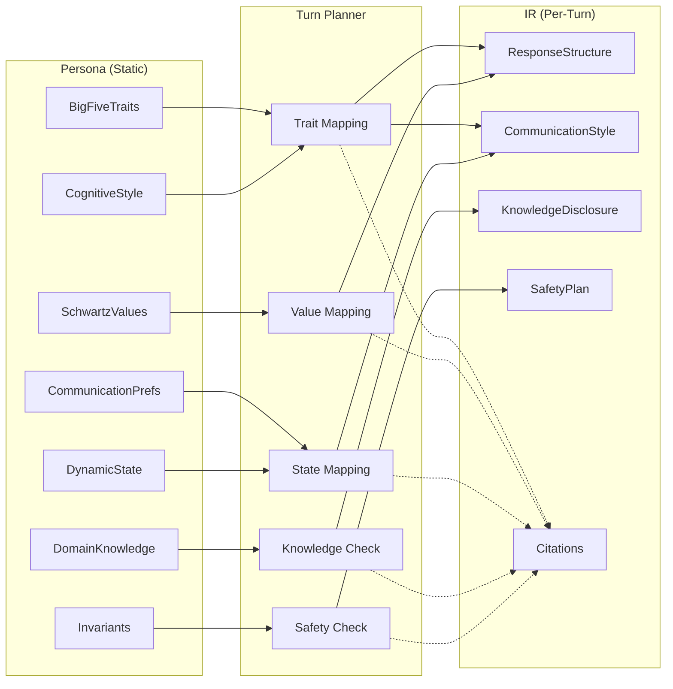

---

## 3. Turn Planner Engine

### 3.1 Overview

The Turn Planner is the central orchestrator. It accepts user input, a persona, and conversational state, and produces a fully-populated IR. It enforces a strict **canonical modifier composition sequence** — `base → role → trait → state → bias → constraints` — guaranteeing no double-counting, full citation trails, and deterministic output.

### 3.2 Five-Stage Pipeline

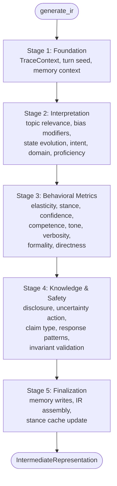

### 3.3 Stage Details

#### Stage 1 — Foundation
1. Create fresh `TraceContext` and `MemoryOps`
2. Compute deterministic per-turn seed via `SHA-256(base_seed:conversation_id:turn_number)`
3. Load memory context for current topic/turn

#### Stage 2 — Interpretation
1. **Topic Relevance**: Keyword overlap between user input tokens and persona interests. Formula: `relevance = covered_indices / total_tokens`
2. **Bias Modifiers**: `BiasSimulator.compute_modifiers()` → `list[BiasModifier]`
3. **State Evolution**: `StateManager.evolve_state_post_turn()` → mood drift, fatigue accumulation, stress decay
4. **Intent Analysis**: `analyze_intent()` → `(mode, goal, user_intent, needs_clarification)`
5. **Domain Detection**: Keyword-based scoring against 12-domain registry + persona domains
6. **Expert Eligibility**: `is_domain_specific AND proficiency >= expert_threshold`

#### Stage 3 — Behavioral Metrics

All numeric fields use **cross-turn inertia smoothing**: `smoothed = prev × 0.15 + new × 0.85`

| Metric | Modifier Sequence |
|---|---|
| **Elasticity** | openness trait → cognitive complexity blend → confirmation bias → clamp [0.1, 0.9] |
| **Stance** | cache check → generate new (expert template OR values-based opinion) → validate invariants |
| **Confidence** | proficiency base → trait (C, N) → cognitive style → authority bias → clamp [0, 1] |
| **Competence** | direct domain match OR adjacency fallback → openness modifier → memory familiarity boost |
| **Tone** | mood valence/arousal → stress → negativity bias → trait gates → map to 26-tone enum |
| **Verbosity** | conscientiousness-derived → fatigue override (brief) OR engagement override (detailed) OR extreme introversion (minimal) |
| **Formality** | base prefs → 70/30 social role blend → trait → state → clamp [0, 1] |
| **Directness** | base prefs → 70/30 social role blend → agreeableness → patience → clamp [0, 1] |

#### Stage 4 — Knowledge & Safety
1. **Disclosure**: base openness → extraversion → state → trust modifier → privacy filter clamp → topic sensitivity clamp
2. **Uncertainty Action**: proficiency + confidence + risk tolerance + need for closure + cognitive complexity + competence → `ANSWER|HEDGE|ASK|REFUSE|SPECULATE_WITH_DISCLAIMER|DEFER_TO_AUTHORITY|REFRAME_QUESTION|OFFER_PARTIAL|ACKNOWLEDGE_AND_REDIRECT`
3. **Claim Type**: proficiency + uncertainty action + domain specificity → claim enum
4. **Response Patterns**: trigger matching → safety filtering (must_avoid veto)
5. **Invariant Validation**: stance vs cannot_claim + must_avoid

#### Stage 5 — Finalization
1. Build memory write intents (episode + relationship entries)
2. Propagate invariants to SafetyPlan
3. Assemble IR with all citations, safety plan, and memory ops
4. Cache stance for multi-turn consistency
5. Store `TurnSnapshot` for next-turn inertia

### 3.4 TraceContext

Centralized audit log created fresh each turn. Every field mutation goes through one of:

| Method | Purpose |
|---|---|
| `ctx.num()` | Apply numeric modifier with auto-citation |
| `ctx.enum()` | Apply enum/string modifier with auto-citation |
| `ctx.clamp()` | Clamp value and record in safety plan |
| `ctx.base()` | Initialize a numeric field |
| `ctx.block_topic()` | Add to blocked topics |
| `ctx.block_pattern()` | Add to pattern blocks |

### 3.5 Domain Detection

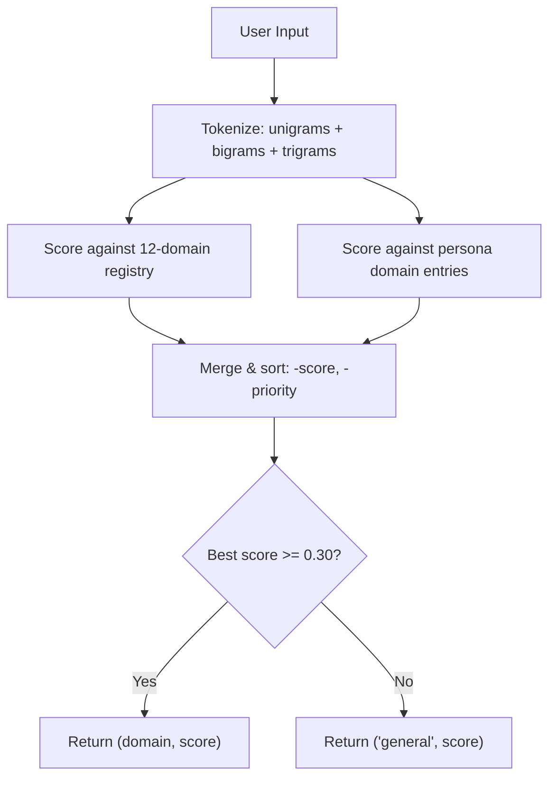

12 built-in domains: psychology, technology, business, health, personal, food, science, arts, education, law, sports, finance.

### 3.6 Stance Generation

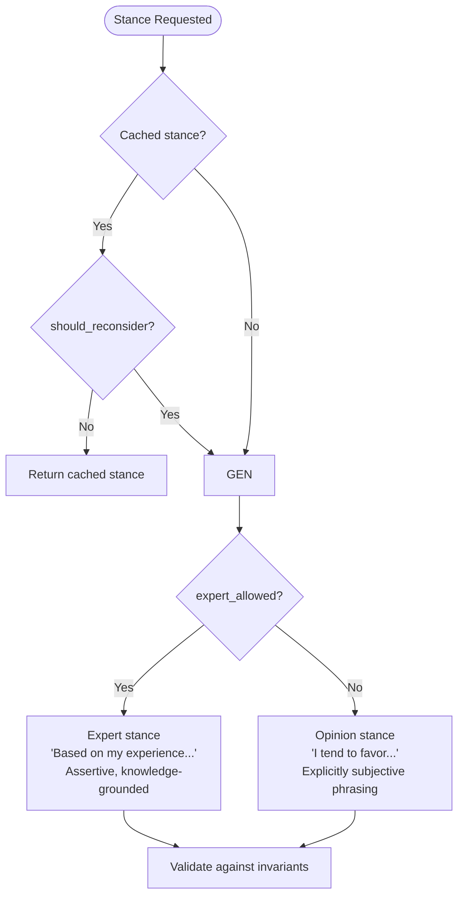

### 3.7 EngineConfig

All previously-hardcoded magic numbers centralized in a frozen dataclass:

| Parameter | Default | Description |
|---|---|---|
| `default_proficiency` | 0.3 | Proficiency for unknown domains |
| `expert_threshold` | 0.7 | Minimum proficiency for expert claims |
| `cross_turn_inertia` | 0.15 | Alpha for exponential smoothing |
| `elasticity_min/max` | 0.1 / 0.9 | Elasticity bounds |
| `evidence_stress_threshold` | 0.4 | Evidence strength above which stress triggers |
| `unknown_domain_base` | 0.10 | Competence floor for unknown domains |
| `debate_directness_bonus` | 0.15 | Extra directness in debate mode |

---

## 4. Behavioral Interpreters Engine

### 4.1 Overview

Eight modules translate abstract psychological profiles into concrete behavioral parameters:

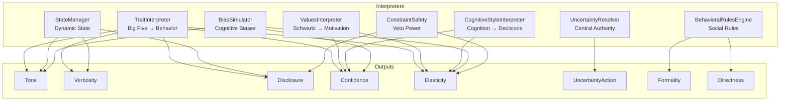

### 4.2 TraitInterpreter (Big Five → Behavior)

| Trait | Key Outputs | Formula |
|---|---|---|
| **Openness** | Elasticity | `clamp(0.1, 0.9, O × 0.7 - confidence × 0.3 + 0.2)` |
| **Conscientiousness** | Verbosity adjustment | `base + (C - 0.5) × 0.2` |
| **Extraversion** | Disclosure modifier | `(E - 0.5) × 0.4` (range ±0.2) |
| **Agreeableness** | Directness adjustment | `base + (0.5 - A) × 0.3` (high A = less direct) |
| **Neuroticism** | Stress sensitivity, confidence | `confidence - N × 0.15` |

**Confidence modifier**: `clamp(0.1, 0.95, proficiency + (C - 0.5) × 0.1 - N × 0.15)`

**Tone selection**: Decision tree combining mood_valence, mood_arousal, stress, and trait modifiers → maps to one of 26 `Tone` enum values. Stress gate (`> 0.6 AND N > 0.6`), extraversion bonus (`> 0.7` → +0.2 arousal), openness gate (`> 0.6` → `THOUGHTFUL_ENGAGED`). Trait-gated expansions: high E + low N → `AMUSED_PLAYFUL`, high O + moderate arousal → `CURIOUS_INTRIGUED`, very low valence + high N → `GRIEVING_SORROWFUL`, high A + moderate valence → `NOSTALGIC_WISTFUL`, low A + negative valence → `CONTEMPTUOUS_DISMISSIVE`, neutral arousal spike → `SURPRISED_CAUGHT_OFF_GUARD`, low confidence + moderate arousal → `CONFUSED_UNCERTAIN`, low trust + high N → `GUARDED_WARY`, high E + high arousal → `EAGER_ANTICIPATORY`.

### 4.3 ValuesInterpreter (Schwartz Values)

Implements the Schwartz circumplex with 10 values, conflict detection, and resolution.

**Conflict pairs**: self_direction↔conformity/tradition, stimulation↔security, achievement↔benevolence, power↔universalism (and reciprocals).

**Conflict resolution**: Context-biased (work/personal/social), adjacency-aware. Adjacent values resolve easily (confidence ≥ 0.7); opposing values resolve with tension (confidence ≤ 0.8).

**`ConflictResolution` dataclass**: winner, confidence, is_adjacent, is_opposing, citations.

### 4.4 CognitiveStyleInterpreter

| Dimension | Key Output | Formula |
|---|---|---|
| Analytical/Intuitive | Rationale depth (1-5 steps) | `> 0.7` AND systematic `> 0.7` → 4 steps |
| Risk Tolerance | Confidence boost when uncertain | `confidence + risk_tolerance × 0.3` (when conf < 0.4) |
| Need for Closure | Ambiguity tolerance | `1.0 - need_for_closure` |
| Cognitive Complexity | Elasticity contribution | `complexity × 0.6 + (1 - closure) × 0.4` |

### 4.5 StateManager (Dynamic Mood/Energy)

The only stateful interpreter. Tracks five variables per turn:

| Variable | Range | Drift/Decay |
|---|---|---|
| **Mood valence** | [-1, +1] | Drifts toward baseline via `rate = 0.05 + N × 0.1` |
| **Mood arousal** | [0, 1] | Drifts toward 0.5 baseline |
| **Fatigue** | [0, 1] | Accumulates `0.02 × (length/10) × stamina_mod` per turn |
| **Stress** | [0, 1] | Decays 0.08/turn; spikes with `sensitivity = 1.0 + N × 0.5` |
| **Engagement** | [0, 1] | Smooths toward `relevance + O × 0.2 - fatigue × 0.3` |

**Stress trigger multipliers**: time_pressure (1.0), conflict (1.2 if A > 0.6), uncertainty (1.3 if N > 0.6), complexity (0.7).

When `stress > 0.6`: `mood_valence -= 0.15`, `mood_arousal += 0.2`.
When `fatigue > 0.7`: `engagement -= 0.1`, `mood_arousal -= 0.1`.

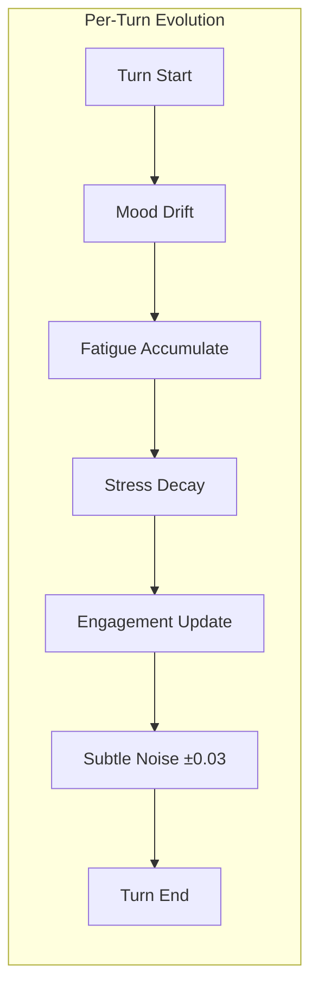

### 4.6 BiasSimulator (Bounded Cognitive Biases)

Three biases, all capped at `MAX_IMPACT = ±0.15`:

| Bias | Trigger | Target | Effect |
|---|---|---|---|
| **Confirmation** | value_alignment ≥ 0.6 | elasticity | Reduces (resists contrary evidence) |
| **Negativity** | neuroticism ≥ 0.5 + negative markers | arousal | Increases (heightened attention) |
| **Authority** | authority_susceptibility ≥ 0.5 + authority markers | confidence | Increases (defers to authority) |

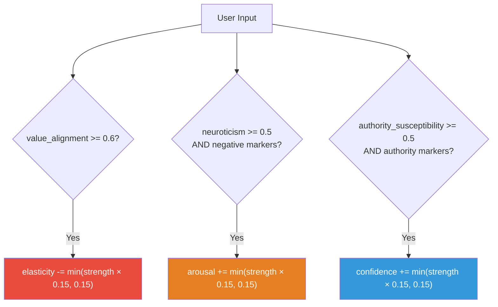

**Negation-aware counting**: 3-token lookback window filters negated markers ("not a problem" doesn't trigger negativity bias).

### 4.7 UncertaintyResolver

Single authoritative decision point. Priority cascade:

1. **Dynamic state**: `effective_confidence = confidence - stress × 0.15 - fatigue × 0.10`
2. **Hard constraint** (proficiency < 0.3): follows `claim_policy.lookup_behavior`
3. **Time pressure** (> 0.7 + confidence > 0.4): → `ANSWER`
4. **Fatigue override** (> 0.7 + confidence < 0.7): → `HEDGE`
5. **Cognitive style**: decision tree on confidence × risk_tolerance × need_for_closure

### 4.8 ConstraintSafety (Veto Power)

Three pure functions that act as the final safety net:

1. **`apply_response_pattern_safely()`**: must_avoid hard block → topic sensitivity cap → privacy filter
2. **`validate_stance_against_invariants()`**: cannot_claim (error) + must_avoid (error)
3. **`clamp_disclosure_to_constraints()`**: `max = min(1 - privacy_sensitivity, 1 - topic_filter)`

---

## 5. Memory System Engine

### 5.1 Overview

Gives personas the ability to remember across turns. Designed around **immutability** (frozen dataclasses), **capacity-bounded stores** (deterministic eviction), **privacy-aware retrieval**, and the **never-verbatim principle**.

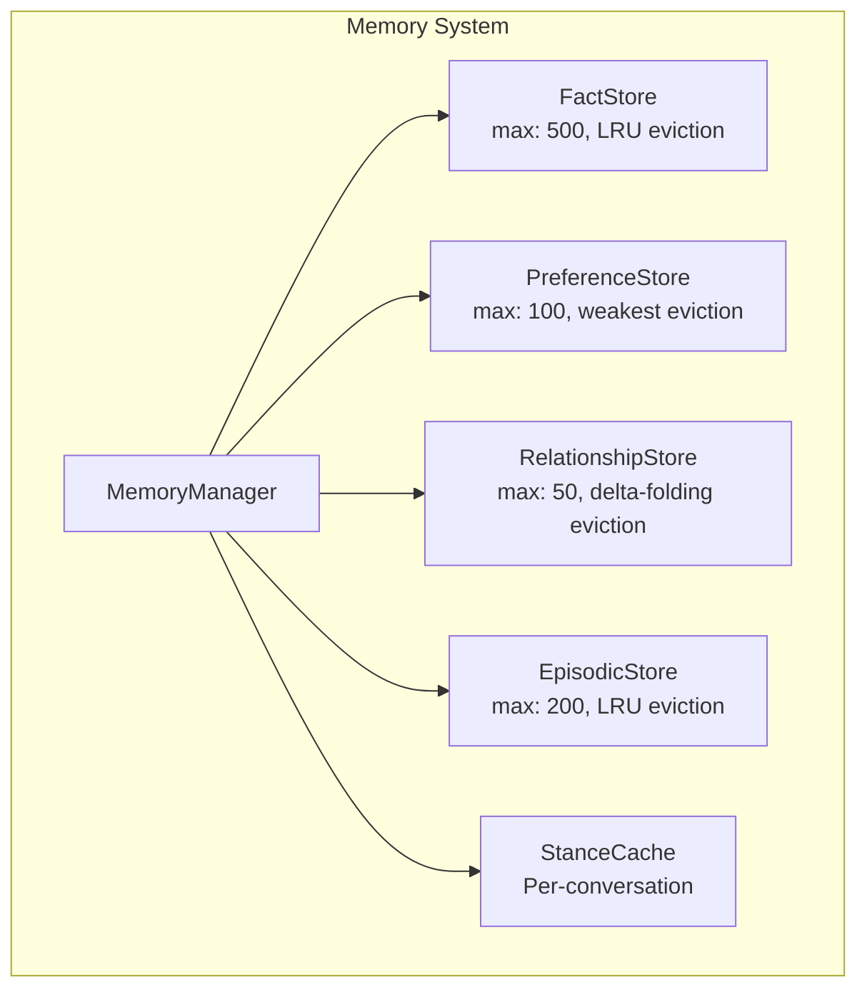

### 5.2 Four Memory Types

| Type | What It Stores | Key Feature | Eviction Strategy |
|---|---|---|---|
| **Facts** | Concrete user info ("User is a UX designer") | Category indexing + privacy filtering | LRU (oldest first) |
| **Preferences** | Behavioral patterns ("User prefers brief answers") | Reinforcement strengthening | Weakest aggregate |
| **Relationships** | Trust/rapport dynamics (trust: 0.72) | Running scores via delta events | Delta-folding into base |
| **Episodes** | Compressed summaries ("Discussed AI ethics") | Topic-indexed, never verbatim | LRU (oldest turn_end) |

### 5.3 Key Formulas

| Formula | Expression |
|---|---|
| **Memory confidence decay** | `max(0.0, confidence - age × 0.02)` — expires at 50 turns |
| **Stance strength decay** | `max(0.0, 1.0 - age × 0.1)` — expires at 10 turns (5× faster) |
| **Preference reinforcement** | `min(1.0, latest.strength + (observations - 1) × 0.1)` |
| **Trust/rapport score** | `clamp(0, 1, base + cached_delta_sum)` |
| **Stance reconsideration** | `(evidence × 0.5) + (elasticity × 0.3) + ((1-strength) × 0.3) - (confidence × 0.2) > 0.5` |

### 5.4 Memory Flow Per Turn

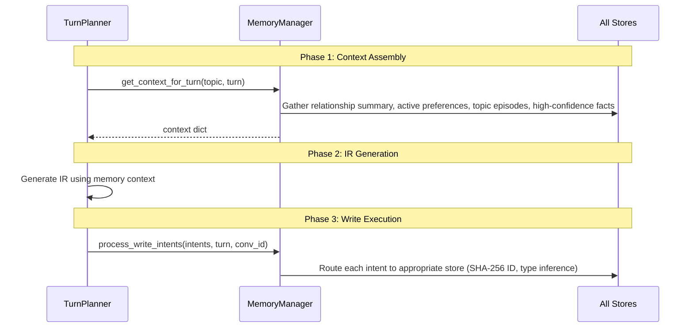

### 5.5 Relationship Trust Evolution

Trust and rapport evolve through delta events with keyword-based inference:

| Signal | Keywords | Delta |
|---|---|---|
| Positive trust | agreed, validated, expertise, helpful, accurate | +0.05 |
| Positive rapport | friendly, warm, laughed, explored | +0.05 |
| Deep rapport | shared personal, opened up | +0.08 |
| Negative trust | challenged, disagreed, questioned | -0.05 |
| Negative rapport | tension, awkward, defensive | -0.05 |

**Delta-folding eviction**: When at capacity, the oldest event's deltas are absorbed into base trust/rapport, preserving accumulated state.

---

## 6. Response Generation Engine

### 6.1 Overview

Converts a fully-computed IR into natural language text. Supports four backends behind a unified adapter interface.

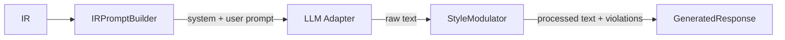

### 6.2 Adapter Pattern

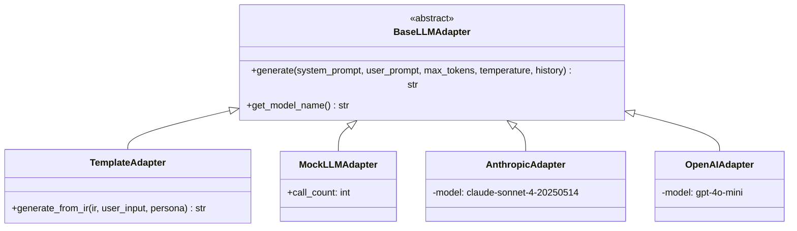

| Backend | API Key? | Cost | Use Case |
|---|---|---|---|
| **Template** | No | Free | Rule-based text from IR fields |
| **Mock** | No | Free | Deterministic responses for testing |
| **Anthropic** | Yes | Pay-per-use | Claude API (Haiku/Sonnet/Opus) |
| **OpenAI** | Yes | Pay-per-use | GPT models |

### 6.3 Dynamic Temperature

```
temperature = max(0.3, 1.0 - confidence × 0.5)
```

| Confidence | Temperature | Rationale |
|---|---|---|
| 0.0 | 1.0 | Maximum variation — persona is uncertain |
| 0.5 | 0.75 | Moderate creativity |
| 1.0 | 0.50 | Most deterministic — confident, assertive |

### 6.4 Template Adapter Pipeline

1. **Opener** from `_OPENERS[tone]` (26 tone-specific openers)
2. **Confidence framing**: `< 0.4` → "I think...", `0.4-0.7` → "In my experience,", `≥ 0.7` → direct assertion
3. **Rationale** (medium/detailed verbosity only)
4. **Uncertainty action** sentence
5. **Formality transform**: `> 0.75` → formalize, `< 0.25` → casualize
6. **Length enforcement**: brief → truncate to 2 sentences

### 6.5 StyleModulator (Post-Processing)

Validates generated text against IR constraints:

| Check | Severity | Trigger |
|---|---|---|
| Verbosity | warning | Sentence count outside target range |
| Blocked topics | **error** | `blocked_topic` / `cannot_claim` / `must_avoid` found in text |
| Knowledge claims | warning | Strong assertions without hedging under speculative/none claim type |

### 6.6 IRPromptBuilder

**System prompt** (built once per persona): identity line, background, goals, expert domains, constraints, stay-in-character directive.

**Generation prompt** (built per turn): user message (backtick-escaped), memory context, and 12+ labeled constraint sections (tone, formality, directness, verbosity, confidence, competence, stance, reasoning, claim type, uncertainty handling, blocked topics, clamped limits).

### 6.7 `response/` vs `generation/`

The codebase contains two response packages. `generation/` is the **primary, production path** used by `PersonaEngine.chat()`. `response/` is an **earlier implementation** (deprecated) with a simpler architecture. Key differences: `generation/` adds StyleModulator validation, memory context, conversation history, dynamic temperature, and OpenAI support.

---

## 7. Validation Engine

### 7.1 Overview

Multi-layered guardrail system between IR generation and response rendering. Six discrete validation layers:

| Layer | Module | Stateful? | Severity |
|---|---|---|---|
| IR Validator | `ir_validator.py` | No | error + warning |
| IR Coherence | `ir_coherence.py` | No | warning only |
| Persona Compliance | `persona_compliance.py` | No | **error** + warning |
| Cross-Turn Tracker | `cross_turn.py` | Yes | warning only |
| Knowledge Boundary | `knowledge_boundary.py` | Yes | violation reports |
| Style Drift Detector | `style_drift.py` | Yes | drift reports |

### 7.2 PipelineValidator

Orchestrates the first three layers into a single `validate()` call:

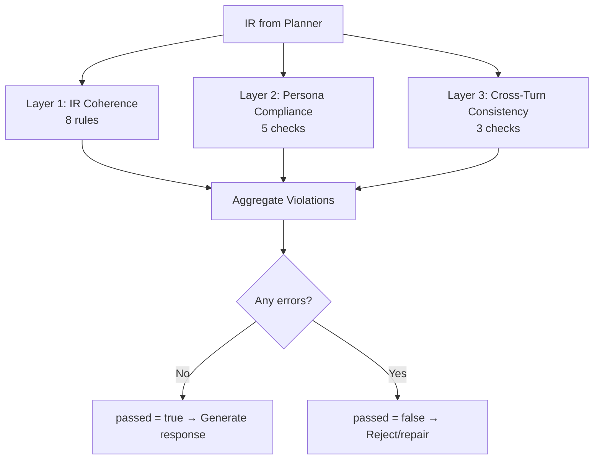

### 7.3 IR Coherence (8 Rules)

| Rule | Condition | Severity |
|---|---|---|
| Confidence-claim mismatch | SPECULATIVE/NONE + confidence > 0.85 | warning |
| Expert low confidence | DOMAIN_EXPERT + confidence < 0.4 | warning |
| High confidence + hedge | confidence > 0.8 + HEDGE | warning |
| Low confidence + answer | confidence < 0.3 + ANSWER | warning |
| Refuse + high disclosure | REFUSE + disclosure > 0.7 | warning |
| Negative tone + high confidence | negative tone + confidence > 0.9 | warning |
| Rigid + uncertain | elasticity < 0.15 + confidence < 0.3 | warning |
| Citation completeness | Key fields missing citations | warning |

### 7.4 Persona Compliance (5 Checks)

**Error-severity violations (generation blockers):**

| Rule | Condition | Severity |
|---|---|---|
| Expert below threshold | DOMAIN_EXPERT + proficiency < 0.7 | **error** |
| Dunning-Kruger | competence < 0.3 + confidence > 0.7 | **error** |
| Forbidden claim | cannot_claim in stance/rationale | **error** |
| Must-avoid leak | must_avoid in content, not in blocked_topics | **error** |

Plus warnings for: trait-style mismatch, disclosure exceeding policy, formality deviation.

### 7.5 Cross-Turn Tracking

| Check | Max Threshold | Severity |
|---|---|---|
| **Parameter swing** | confidence: 0.45, formality: 0.40, directness: 0.40, disclosure: 0.40 | warning |
| **Expertise inconsistency** | Prior DOMAIN_EXPERT, now not | warning |
| **Stance reversal** | Negation pair on same topic (support↔against, agree↔disagree, etc.) | warning |

### 7.6 Knowledge Boundary Enforcer

Standalone stateful enforcer tracking domain-level claim counts:

| Check | Trigger |
|---|---|
| Non-expert making expert claims | DOMAIN_EXPERT + proficiency < threshold |
| High confidence in non-expert domain | proficiency < threshold + confidence > 0.8 + ANSWER |

### 7.7 Style Drift Detector

Sliding window (default 10 turns) detects unjustified behavioral drift:
- Computes population stddev for formality, directness, disclosure, confidence
- Flags fields with stddev > 0.15 (drift threshold)
- Drift is **justified** when state variables (stress, engagement, mood) also shifted

---

## 8. Key Design Principles

1. **Single Source of Truth**: Each IR parameter is computed by one authoritative process
2. **Canonical Modifier Sequence**: base → role → trait → state → bias → clamp — strict order prevents double-counting
3. **Full Citation Trail**: Every decision traceable to its psychological source with before/after deltas
4. **Bounded Biases**: Cognitive biases capped at ±0.15 — observable, never dominant
5. **Deterministic**: Per-turn SHA-256 seeding for reproducible behavior
6. **Stance Consistency**: Cache prevents flip-flopping; decay allows natural opinion evolution
7. **Safety by Design**: Invariants have veto power; constraints are auditable via SafetyPlan
8. **Immutable Memory**: Frozen records with confidence decay prevent persona drift
9. **Backend Agnostic**: Same IR works with templates (free), Claude (smart), or any future LLM
10. **Testable Without Text**: Assert on IR numbers, not generated prose

---

## 9. Module Map

```
persona_engine/
├── __init__.py                    # Public API (20 symbols)
├── __main__.py                    # CLI tool (5 subcommands)
├── engine.py                      # PersonaEngine orchestrator + ChatResult
├── conversation.py                # Multi-turn Conversation wrapper
├── persona_builder.py             # Builder API + from_description parser
├── exceptions.py                  # Typed exception hierarchy
│
├── schema/                        # Data models (no logic)
│   ├── persona_schema.py          #   Persona + 20 sub-models
│   └── ir_schema.py               #   IR + Citation + SafetyPlan + MemoryOps + enums
│
├── planner/                       # IR generation (the brain)
│   ├── turn_planner.py            #   5-stage canonical orchestrator
│   ├── trace_context.py           #   Citation + safety recording
│   ├── intent_analyzer.py         #   Mode/goal/intent inference
│   ├── domain_detection.py        #   Keyword-based domain scoring + adjacency
│   ├── domain_registry.py         #   12 built-in domain definitions
│   ├── stance_generator.py        #   Expert vs opinion stances with invariant validation
│   └── engine_config.py           #   Centralized configuration constants
│
├── behavioral/                    # Psychological interpreters
│   ├── trait_interpreter.py       #   Big Five → behavioral parameters
│   ├── values_interpreter.py      #   Schwartz values + conflict detection
│   ├── cognitive_interpreter.py   #   Reasoning approach patterns
│   ├── state_manager.py           #   Dynamic mood/fatigue/stress/engagement
│   ├── bias_simulator.py          #   Bounded cognitive biases (±0.15)
│   ├── rules_engine.py            #   Social roles + decision policies
│   ├── constraint_safety.py       #   Pattern validation + invariant checking (veto power)
│   └── uncertainty_resolver.py    #   Single authoritative uncertainty decision
│
├── memory/                        # Conversational memory
│   ├── models.py                  #   Immutable typed records (Fact, Preference, etc.)
│   ├── fact_store.py              #   Concrete user info (cap: 500, decay: 0.02/turn)
│   ├── preference_store.py        #   Behavioral patterns (cap: 100, reinforcement: +0.1)
│   ├── relationship_store.py      #   Trust/rapport dynamics (cap: 50, delta-folding)
│   ├── episodic_store.py          #   Compressed summaries (cap: 200, never verbatim)
│   ├── stance_cache.py            #   Multi-turn stance consistency (decay: 0.1/turn)
│   └── memory_manager.py          #   Orchestrator for all stores
│
├── generation/                    # Response generation (IR → text) — PRIMARY
│   ├── llm_adapter.py             #   Base + Template, Mock, Anthropic, OpenAI adapters
│   ├── response_generator.py      #   Main orchestrator (4 backends)
│   ├── prompt_builder.py          #   IR → system/user prompts for LLMs
│   └── style_modulator.py         #   Post-processing constraint enforcement
│
├── response/                      # Alternative response module (deprecated)
│   ├── generator.py               #   Older ResponseGenerator
│   ├── adapters.py                #   Older adapter implementations
│   ├── prompt_builder.py          #   Single-prompt architecture
│   └── schema.py                  #   GeneratedResponse + ResponseConfig
│
├── validation/                    # Multi-layer validation
│   ├── pipeline_validator.py      #   Top-level orchestrator (3 layers)
│   ├── ir_validator.py            #   Field-level range + consistency (5 checks)
│   ├── ir_coherence.py            #   Cross-field logical consistency (8 rules)
│   ├── persona_compliance.py      #   IR vs persona alignment (5 checks, 4 errors)
│   ├── cross_turn.py              #   Multi-turn consistency (swing, claim, stance)
│   ├── knowledge_boundary.py      #   Domain expertise boundary enforcement
│   └── style_drift.py             #   Sliding-window behavioral drift detection
│
└── utils/
    └── determinism.py             #   Seeded randomness manager

examples/
├── quick_chat.py                  # Minimal chat example
├── custom_persona.py              # Custom persona creation
├── multi_turn.py                  # Multi-turn conversation
├── persona_comparison.py          # Comparing multiple personas
├── ir_debugging.py                # IR inspection and debugging
├── ir_usage_example.py            # Comprehensive IR usage
└── conversation_demo.py           # Conversation wrapper demo
```

---

## Data Flow — Complete Single Turn Example

```
User says: "What do you think about AI in UX research?"
Persona: Sarah (UX Researcher, high openness, benevolence value, 0.85 psychology proficiency)
Turn: 3

MEMORY
  → "User is a UX designer" (fact, confidence 0.9)
  → Trust: 0.72, Rapport: 0.65 (relationship)

INTENT ANALYSIS
  → "What do you think" + ? → goal: BUILD_RAPPORT
  → No mode keywords → mode: CASUAL_CHAT
  → user_intent: "ask"

DOMAIN DETECTION
  → Keywords: "ai" (tech), "ux" (psych), "research" (psych)
  → Persona domain match: psychology (proficiency: 0.85)
  → Expert eligible: YES (domain-specific + 0.85 ≥ 0.7)

ELASTICITY
  → Base (openness 0.75): 0.70
  → Cognitive blend (complexity 0.65): 0.675
  → Confirmation bias (value alignment 0.8): -0.12 → 0.555
  → Clamp [0.1, 0.9]: 0.555

STANCE
  → Cache: no prior stance on "ai_ux_research"
  → Expert template: "Based on my experience, AI enhances
     research when centered on user wellbeing"
  → Rationale: "0.85 proficiency + benevolence (0.82)"

CONFIDENCE
  → Base (proficiency): 0.85
  → Trait modifier (C=0.72, N=0.35): +0.08 → 0.93
  → Authority bias: no authority markers → no change
  → Clamp [0, 1]: 0.93

TONE
  → Mood: valence +0.3, arousal 0.6
  → Stress: 0.2 (low)
  → Map: positive + moderate arousal → THOUGHTFUL_ENGAGED

COMMUNICATION STYLE
  → Base: formality 0.4, directness 0.6
  → Role (casual=friend): formality 0.2, directness 0.5
  → Blend (70/30): formality 0.26, directness 0.53
  → Trait (agreeableness 0.78): directness → 0.46

DISCLOSURE
  → Base openness: 0.50
  → Extraversion (0.65): +0.06 → 0.56
  → State (mood +0.3): +0.04 → 0.60
  → Privacy filter: 0.60 < 0.70 max → OK
  → Clamp: 0.60

IR OUTPUT
  confidence: 0.93, competence: 0.85, tone: thoughtful_engaged
  formality: 0.26, directness: 0.46, disclosure: 0.60
  claim: domain_expert, uncertainty: answer, verbosity: medium
  citations: 15 entries, safety: clean

VALIDATION
  → IR Coherence: 0 violations
  → Persona Compliance: 0 violations
  → Cross-Turn: within swing thresholds
  → Result: PASSED

RESPONSE (Template)
  "I find this really fascinating — from my years in UX
   research, AI tools work best when they're designed with
   actual users in mind, not just metrics. The human empathy
   piece is what makes the difference."
```

---

## Project Status

| Phase | Description | Status |
|-------|-------------|--------|
| 1 | Schema & Foundation (Persona + IR) | Complete |
| 2 | Behavioral Interpreters (Big Five, Values, Cognitive, State, Bias) | Complete |
| 3 | Turn Planner (5-stage canonical sequence + TraceContext) | Complete |
| 4 | Memory System (4 stores + manager + stance cache) | Complete |
| 5 | Response Generation (Template, Mock, Anthropic, OpenAI) | Complete |
| 6 | Validation Layer (6 validators + pipeline orchestrator) | Complete |
| 7 | SDK Packaging (PersonaEngine, Conversation, Builder, CLI, examples) | Complete |

**Test Suite**: 1,899 tests passing, 0 mypy errors
