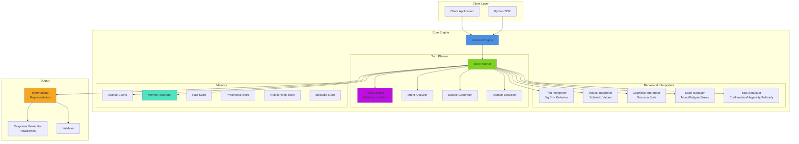
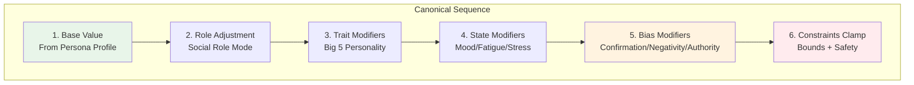
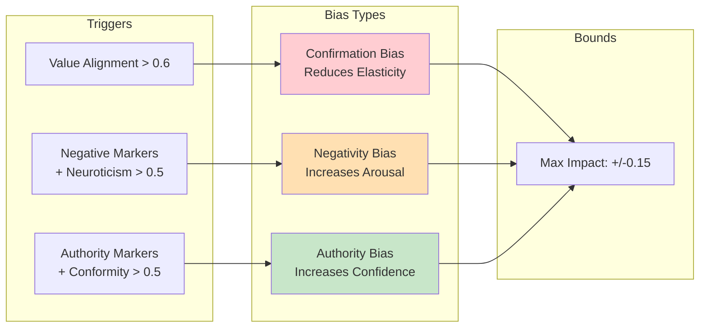
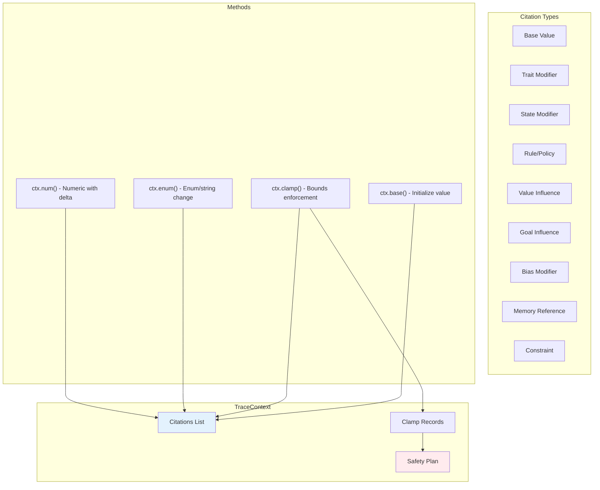

# Persona Engine — Architecture & Design Document

A psychologically-grounded conversational persona system that creates behaviorally coherent synthetic humans for testing, research, and simulation.

---

## What Is This?

Persona Engine makes AI conversations feel like talking to a **real person** — not just any person, but a *specific* person with defined psychology, values, expertise, biases, and memories.

It does this by generating a structured **Intermediate Representation (IR)** — a complete blueprint for *how* to respond — before any text is written. This makes persona behavior **testable, debuggable, and deterministic** without ever needing to call an LLM.

---

## The Core Idea

Most chatbot "personality" systems work like this:
> "You are a friendly assistant who likes coffee. Respond helpfully."

That's a prompt hack. It's fragile, untestable, and produces inconsistent behavior.

Persona Engine works differently. Instead of injecting personality into a prompt, it **computes personality from psychology**:

```
Persona Profile (Big Five traits, Schwartz values, cognitive style, expertise, constraints)
        |
   Turn Planner (16-step canonical computation)
        |
   Intermediate Representation (structured numbers + enums + citations)
        |
   Response Generator (template or LLM turns the IR into text)
```

The IR is the key insight. It's a structured object that says things like:
- confidence: 0.82 (this persona is fairly certain about this topic)
- tone: thoughtful_engaged (not anxious, not enthusiastic — thoughtfully engaged)
- directness: 0.46 (moderately diplomatic, not blunt)
- knowledge_claim_type: domain_expert (they're qualified to speak on this)
- disclosure_level: 0.60 (moderately open, not oversharing)

Every single number has a **citation trail** showing exactly which trait, value, rule, or constraint produced it — and by how much.

---

## Why an IR?

Three reasons:

**1. Testability.** You can write `assert ir.response_structure.confidence > 0.7` to verify a domain expert sounds confident — without generating text, without calling an API, without subjective judgment.

**2. Debuggability.** When a persona says something wrong, you can trace it back through the citations: "Ah, the confirmation bias modifier reduced elasticity by -0.12, which made the stance too rigid." You can't do this with a prompt.

**3. Determinism.** Same persona + same input + same seed = identical IR, every time. Per-turn SHA-256 seeding makes failures reproducible.

---

## The Persona Profile

A persona is defined as a structured profile with these components:

### Psychology

| Component | What It Models | Example |
|-----------|---------------|---------|
| **Big Five Traits** (OCEAN) | Core personality dimensions (0-1 each) | Openness: 0.75, Conscientiousness: 0.72, Extraversion: 0.65, Agreeableness: 0.78, Neuroticism: 0.35 |
| **Schwartz Values** | 10 basic human values that drive decisions | Benevolence: 0.82, Self-direction: 0.71, Achievement: 0.45 |
| **Cognitive Style** | How the person thinks and reasons | Analytical-intuitive: 0.65, Risk tolerance: 0.6, Need for closure: 0.55 |
| **Communication Preferences** | Baseline speaking style | Verbosity: medium, Formality: 0.4, Directness: 0.6 |

### Knowledge & Identity

| Component | What It Models | Example |
|-----------|---------------|---------|
| **Identity** | Demographics and background | Age: 34, Occupation: UX Researcher, Location: Portland |
| **Domain Knowledge** | Areas of expertise with proficiency scores | Psychology: 0.85, Technology: 0.45 |
| **Goals** | Life/work priorities | "Advance UX research methodology" (weight: 0.8) |

### Behavioral Rules

| Component | What It Models | Example |
|-----------|---------------|---------|
| **Social Roles** | How behavior shifts by context | At work: formality 0.7, With friends: formality 0.2 |
| **Decision Policies** | Conditional behavioral rules | "When facing ethical dilemma -> prioritize user welfare" |
| **Response Patterns** | Triggered reactions | Trigger: "how are you" -> warm greeting + brief personal update |
| **Biases** | Cognitive biases (bounded at +/-0.15) | Confirmation bias: 0.6, Authority bias: 0.4 |

### Safety & Constraints

| Component | What It Models | Example |
|-----------|---------------|---------|
| **Persona Invariants** | Hard boundaries that cannot be violated | Cannot claim: "medical doctor". Must avoid: "employer name" |
| **Claim Policy** | What knowledge claims are allowed | Only claim domain_expert in known domains |
| **Uncertainty Policy** | How to handle not knowing | Admission threshold: 0.4, Hedging frequency: 0.6 |
| **Disclosure Policy** | How open to be about personal info | Base openness: 0.5, Trust factor: 0.3 |

---

## System Overview



---

## The IR Structure

The Intermediate Representation has 7 sections:

```
IntermediateRepresentation
|
+-- conversation_frame          # WHERE are we?
|   +-- interaction_mode        #   casual_chat, interview, debate, ...
|   +-- goal                    #   build_rapport, educate, persuade, ...
|   +-- success_criteria        #   optional specific objectives
|
+-- response_structure          # WHAT to say
|   +-- intent                  #   "Share perspective on AI in UX"
|   +-- stance                  #   "AI enhances research when centered on users"
|   +-- rationale               #   "Based on 8yr experience + benevolence value"
|   +-- elasticity   [0-1]     #   willingness to change mind
|   +-- confidence   [0-1]     #   certainty in the response
|
+-- communication_style         # HOW to say it
|   +-- tone                    #   17 emotional tones (warm_enthusiastic, anxious_stressed, ...)
|   +-- verbosity               #   brief, medium, detailed
|   +-- formality    [0-1]     #   casual <-> very formal
|   +-- directness   [0-1]     #   diplomatic <-> blunt
|
+-- knowledge_disclosure        # HOW MUCH to reveal
|   +-- disclosure_level [0-1] #   how open with personal info
|   +-- uncertainty_action      #   answer, hedge, ask_clarifying, refuse
|   +-- knowledge_claim_type    #   domain_expert, personal_experience, speculative, none
|
+-- citations[]                 # WHY -- full audit trail
|   +-- Citation
|       +-- source_type         #   trait, value, rule, state, bias, constraint
|       +-- source_id           #   "agreeableness", "benevolence", "confirmation_bias"
|       +-- target_field        #   "communication_style.directness"
|       +-- operation           #   set, add, multiply, clamp, blend
|       +-- value_before        #   0.680
|       +-- value_after         #   0.547
|       +-- delta               #   -0.133 (auto-computed)
|       +-- reason              #   "Inverse correlation: A=0.72 -> modifier=-0.133"
|
+-- safety_plan                 # WHAT'S BLOCKED
|   +-- active_constraints      #   ["privacy_filter", "claim_policy"]
|   +-- blocked_topics          #   ["employer_name"]
|   +-- clamped_fields          #   {field: [ClampRecord(proposed, actual, reason)]}
|   +-- pattern_blocks          #   ["Pattern blocked: mentions must_avoid topic"]
|
+-- memory_ops                  # WHAT TO REMEMBER
    +-- read_requests           #   [MemoryReadRequest(query_type, query)]
    +-- write_intents           #   [MemoryWriteIntent(content, confidence, privacy)]
    +-- write_policy            #   "strict" (only high-confidence) or "lenient"
```

---

## The Canonical Modifier Sequence

This is the heart of the engine. The Turn Planner follows a strict 16-step sequence to build the IR. The order matters — each step builds on previous steps, preventing double-counting.



### Phase 1: Context Setup

| Step | What Happens | Why |
|------|-------------|-----|
| 1 | Initialize TraceContext + per-turn deterministic seed | SHA-256(base_seed + conv_id + turn_number) ensures reproducibility |
| 2 | Compute topic relevance | How relevant is user input to persona's domains and goals? |
| 3 | Compute bias modifiers | Confirmation, negativity, authority biases — bounded at +/-0.15 |
| 4 | Evolve dynamic state | Mood drifts toward baseline, fatigue accumulates, stress decays |

### Phase 2: Understanding

| Step | What Happens | Why |
|------|-------------|-----|
| 5 | Intent analysis | Infer interaction mode & goal if not set. Classify user intent (ask/request/challenge/share/clarify). Detect if clarification needed |
| 6 | Domain detection | Keyword-based scoring against domain registry. Persona domains get priority tiebreaker |
| 7 | Expert eligibility | Is this domain-specific AND proficiency >= 0.7? This gates everything downstream |

### Phase 3: Core Computation

| Step | What Happens | Modifier Sequence |
|------|-------------|-------------------|
| 8 | Elasticity | openness trait -> cognitive complexity blend -> confirmation bias -> clamp [0.1, 0.9] |
| 9 | Evidence detection | Challenge markers in input trigger stance reconsideration + stress |
| 10 | Stance | Cache check -> generate new (expert template or values-based opinion) -> validate against invariants |
| 11 | Confidence | proficiency base -> trait modifiers -> cognitive style -> authority bias -> clamp [0, 1] |
| 12 | Tone | mood valence/arousal -> stress influence -> negativity bias -> map to 17-tone enum |
| 13 | Verbosity | conscientiousness-derived -> fatigue override (brief) or engagement override (detailed) |

### Phase 4: Style & Safety

| Step | What Happens | Modifier Sequence |
|------|-------------|-------------------|
| 14 | Communication style | formality & directness: base prefs -> 70/30 social role blend -> trait -> state -> clamp |
| 15 | Disclosure | base openness -> extraversion -> state -> privacy filter clamp -> topic sensitivity clamp -> clamp [0,1] |
| 16 | Uncertainty action | hard constraint (claim policy) -> time pressure -> cognitive style default |
| 17 | Knowledge claim type | proficiency + uncertainty action + domain specificity -> claim enum |
| 18 | Response patterns | check triggers, validate against constraints (must_avoid = hard veto) |
| 19 | Invariant validation | stance vs identity_facts + cannot_claim |

### Phase 5: Assembly

| Step | What Happens | Why |
|------|-------------|-----|
| 20 | Assemble IR | All components combined with citations, safety plan, memory ops |
| 21 | Cache stance | Store in stance cache for multi-turn consistency |

**Key principle**: Each step receives output from previous steps. No step reaches back to modify earlier decisions. This makes the sequence deterministic and auditable.

---

## The Behavioral Interpreters

Each psychological dimension has a dedicated interpreter that translates abstract traits into concrete behavioral parameters.

### TraitInterpreter (Big Five -> Behavior)

| Trait | What It Influences | How |
|-------|-------------------|-----|
| **Openness** | Elasticity, abstract reasoning | High O = willing to change mind, uses metaphors |
| **Conscientiousness** | Verbosity, planning language | High C = more detailed, structured responses |
| **Extraversion** | Disclosure, enthusiasm, response length | High E = more self-disclosure, warmer |
| **Agreeableness** | Directness, validation tendency | High A = less direct, validates before disagreeing |
| **Neuroticism** | Stress sensitivity, confidence, tone | High N = lower confidence, more stress-reactive |

### ValuesInterpreter (Schwartz Values)

The 10 Schwartz values drive stance decisions — they answer the "why" behind opinions:
- Extracts top values that shape stances
- Detects value **conflicts** (e.g., self-direction vs conformity) that create realistic internal tension
- Values appear in stance rationale: "I favor this because of my commitment to user welfare (benevolence)"

**Built-in conflict pairs**: self-direction vs conformity/tradition, stimulation vs security, achievement vs benevolence, power vs universalism — and their reciprocals.

### CognitiveStyleInterpreter (How They Think)

| Dimension | What It Controls |
|-----------|-----------------|
| Analytical vs Intuitive | Rationale depth: analytical = 3-4 reasoning steps, intuitive = 1 step |
| Systematic vs Heuristic | Decision approach: systematic = extended deliberation, heuristic = quick gut feel |
| Risk Tolerance | Confidence adjustments: high risk tolerance = more willing to commit |
| Need for Closure | Uncertainty tolerance: high NFC = pushes toward definitive answers |
| Cognitive Complexity | Elasticity: high complexity = more nuanced, willing to hold multiple views |

### StateManager (Dynamic Mood/Energy)

The persona's internal state changes during conversation, just like a real person:

| Dimension | Range | Behavior |
|-----------|-------|----------|
| **Mood valence** | -1.0 to +1.0 | Drifts toward baseline each turn. High neuroticism = slower drift (moodiness) |
| **Mood arousal** | 0.0 to 1.0 | Calm to excited. Spikes on engagement, decays naturally |
| **Fatigue** | 0.0 to 1.0 | Accumulates ~0.02/turn. High fatigue = shorter responses |
| **Stress** | 0.0 to 1.0 | Decays ~0.08/turn but spikes on challenges. Affects tone and patience |
| **Engagement** | 0.0 to 1.0 | Tracks topic relevance. High engagement = longer, more enthusiastic responses |

### BiasSimulator (Subtle Human Biases)

Three bounded biases (max impact +/-0.15) make personas feel more human:



All biases are:
- **Observable**: Cited in the IR with source_type="bias"
- **Bounded**: Never exceed +/-0.15 impact on any parameter
- **Deterministic**: Same input + persona = same bias activation
- **Overridable**: Never trump expertise boundaries or safety constraints

---

## Safety & Constraints

Four layers of safety prevent personas from saying things they shouldn't:

### Layer 1: Persona Invariants (Hardcoded Rules)
- **identity_facts**: Things the persona IS ("Lives in Portland", "Has 2 kids") — stance cannot contradict these
- **cannot_claim**: Things the persona must NEVER claim ("medical doctor", "lawyer") — hard veto
- **must_avoid**: Topics that are completely blocked ("employer name", "participant data") — hard veto

### Layer 2: Claim Policy (Knowledge Boundaries)
- Non-experts produce opinions/preferences, NOT factual claims
- Expert eligibility requires: domain-specific topic AND proficiency >= 0.7
- Expert stance templates: "Based on my experience..." (authoritative but bounded)
- Non-expert stance templates: "I tend to favor...", "I'm inclined to think..." (explicitly subjective)

### Layer 3: Constraint Safety (Runtime Validation)
- Response patterns validated against must_avoid (hard veto blocks the pattern)
- Privacy filter caps disclosure_level at `1.0 - privacy_sensitivity`
- Topic sensitivity further constrains disclosure for sensitive subjects
- Invariant validation checks stance text against identity_facts and cannot_claim

### Layer 4: Safety Plan (Audit Trail)
Everything that was blocked, clamped, or constrained is recorded in the IR's `safety_plan`:
```
safety_plan:
  active_constraints: ["privacy_filter", "claim_policy", "must_avoid"]
  blocked_topics: ["employer_name"]
  clamped_fields:
    disclosure_level: [{proposed: 0.9, actual: 0.3, reason: "Privacy filter"}]
  pattern_blocks: ["Pattern 'share_work_story' blocked: mentions must_avoid 'employer_name'"]
```

---

## Memory System

The memory system gives personas the ability to remember things across turns within a conversation.

### Four Memory Types

| Type | What It Stores | Example | Key Feature |
|------|---------------|---------|-------------|
| **Facts** | Concrete user information | "User is a UX designer in Seattle" | Category indexing + privacy filtering |
| **Preferences** | Learned behavioral patterns | "User prefers brief answers" | Reinforcement — repeated signals strengthen |
| **Relationships** | Trust and rapport dynamics | Trust: 0.72, Rapport: 0.65 | Running scores via delta events |
| **Episodes** | Compressed conversation summaries | "Discussed AI ethics, user was skeptical" | Topic-indexed, never verbatim |

### Memory Design Principles

- **Immutable records**: All memory records are frozen dataclasses. Updates create new records, preventing accidental mutation.
- **Confidence decay**: Memories fade over turns: `confidence * e^(-0.02 * turns_elapsed)`. Old memories naturally become less influential.
- **Privacy levels**: Each fact has a privacy level (0-1). High-privacy facts (0.8+) aren't surfaced at low trust levels.
- **Reinforcement**: When the same preference is observed multiple times, it gets stronger: `min(1.0, base_strength + (n-1) * 0.1)`.
- **Compressed episodes**: The episodic store records summaries, never verbatim transcripts. This prevents persona drift from exact recall.

### Memory Flow

```
Turn N starts
    |
    v
MemoryManager.get_context_for_turn()
    -> Returns: relevant facts, active preferences, trust/rapport scores, recent episodes
    |
    v
TurnPlanner uses memory context
    -> Adjusts confidence (remembered expertise), disclosure (remembered trust), etc.
    |
    v
IR produced with memory_ops
    -> write_intents: ["User mentioned switching to Figma"]
    |
    v
MemoryManager.process_write_intents()
    -> Stores new fact with confidence 0.9, source: user_stated
    |
    v
Turn N+1 starts
    -> get_context_for_turn() now includes "User is switching to Figma"
```

### Stance Cache (Multi-Turn Consistency)

A specialized memory that prevents the persona from flip-flopping on opinions:
- Stances are cached per `topic_signature + interaction_mode`
- Cache entries decay over ~10 turns (natural opinion evolution)
- Strong evidence can trigger reconsideration, but it's gated by elasticity
- Rigid personas (low elasticity) resist changing stance even with evidence
- Formula: reconsider when `evidence_strength > (elasticity * confidence)`

---

## Response Generation

The engine supports 4 backends for turning the IR into text:

| Backend | Purpose | API Key? | Cost |
|---------|---------|----------|------|
| **Template** | Rule-based text from IR fields | No | Free |
| **Mock** | Deterministic canned responses for testing | No | Free |
| **Anthropic** | Real Claude API (Haiku/Sonnet/Opus) | Yes | Pay-per-use |
| **OpenAI** | GPT models (stub for future) | Yes | Pay-per-use |

### Template Backend (Default)

Maps IR fields directly to text using deterministic rules:
- **Tone** -> opener sentence (17 tone-specific openers like "I'm really excited about this!" or "Let me think about that carefully...")
- **Confidence** -> framing language (high: "In my experience...", low: "I think...", "From what I understand...")
- **Stance + rationale** -> core message body
- **Formality** -> word choice transforms (high: formal vocabulary, low: contractions and casual phrasing)
- **Verbosity** -> sentence count enforcement (brief: 1-2, medium: 3-5, detailed: 6+)

### LLM Backend

Builds a system prompt from the IR that encodes all constraints:
- Personality context (trait highlights, value priorities)
- Communication directives (tone, verbosity, formality, directness as specific numbers)
- Knowledge boundaries (what to claim, what to hedge)
- Safety constraints (blocked topics, privacy limits)
- **Dynamic temperature**: `max(0.3, 1.0 - confidence * 0.5)` — higher confidence = lower temperature = more focused output

### StyleModulator (Post-Processing)

After text is generated, validates it against IR constraints:
- Verbosity enforcement (is the response actually the right length?)
- Blocked topic checking (did the LLM accidentally mention a forbidden topic?)
- Knowledge claim coherence (did it claim expertise it shouldn't have?)
- Returns violation records for audit

---

## Citation & Tracing System

Every decision in the IR is fully traceable via `TraceContext`:



A typical IR contains 12-20 citations. Here's what one looks like:

```
Citation:
  source_type: "trait"
  source_id: "agreeableness"
  target_field: "communication_style.directness"
  operation: "add"
  value_before: 0.680
  value_after: 0.547
  delta: -0.133
  effect: "High agreeableness reduces directness"
  weight: 0.8
  reason: "Inverse correlation: A=0.72 -> modifier=-0.133"
```

This tells you: agreeableness (0.72) reduced directness from 0.680 to 0.547 via an additive modifier of -0.133. The `apply_numeric_modifier` helper auto-generates these citations, making it impossible to change a value without documenting why.

---

## Data Flow — Complete Single Turn Example

```
User says: "What do you think about AI in UX research?"
Persona: Sarah (UX Researcher, high openness, benevolence value, 0.85 psychology proficiency)
Turn: 3

MEMORY
  -> "User is a UX designer" (fact)
  -> Trust: 0.72 (relationship)

INTENT ANALYSIS
  -> "What do you think" + question mark -> goal: BUILD_RAPPORT
  -> No mode keywords -> mode: CASUAL_CHAT
  -> user_intent: "ask"

DOMAIN DETECTION
  -> Keywords: "ai" (tech), "ux" (psych), "research" (psych)
  -> Persona domain match: psychology (proficiency: 0.85)
  -> Expert eligible: YES (domain-specific + 0.85 >= 0.7)

ELASTICITY
  -> Base (openness 0.75): 0.70
  -> Cognitive blend (complexity 0.65): 0.675
  -> Confirmation bias (value alignment 0.8): -0.12 -> 0.555
  -> Clamp [0.1, 0.9]: 0.555 (no clamp needed)

STANCE
  -> Cache: no prior stance on "ai_ux_research"
  -> Expert template: "Based on my experience, AI enhances
     research when centered on user wellbeing"
  -> Rationale: "0.85 proficiency + benevolence (0.82)"

CONFIDENCE
  -> Base (proficiency): 0.85
  -> Trait modifier (C=0.72, N=0.35): +0.08 -> 0.93
  -> Authority bias: no authority markers -> no change
  -> Clamp [0, 1]: 0.93

TONE
  -> Mood: valence +0.3, arousal 0.6
  -> Stress: 0.2 (low)
  -> Map: positive + moderate arousal -> THOUGHTFUL_ENGAGED

COMMUNICATION STYLE
  -> Base: formality 0.4, directness 0.6
  -> Role (casual=friend): formality 0.2, directness 0.5
  -> Blend (70/30): formality 0.26, directness 0.53
  -> Trait (agreeableness 0.78): directness -> 0.46

DISCLOSURE
  -> Base openness: 0.50
  -> Extraversion (0.65): +0.06 -> 0.56
  -> State (mood +0.3): +0.04 -> 0.60
  -> Privacy filter: 0.60 < 0.70 max -> OK
  -> Clamp: 0.60

IR OUTPUT
  confidence: 0.93, tone: thoughtful_engaged
  formality: 0.26, directness: 0.46
  disclosure: 0.60, claim: domain_expert
  uncertainty: answer, verbosity: medium
  citations: 15 entries, safety: clean

RESPONSE (Template)
  "I find this really fascinating — from my years in UX
   research, AI tools work best when they're designed with
   actual users in mind, not just metrics. The human empathy
   piece is what makes the difference."

RESPONSE (Claude API)
  (LLM generates natural text guided by IR constraints
   encoded in system prompt)
```

---

## What Makes This Different

| Traditional Chatbot | Persona Engine |
|---|---|
| "Be friendly and helpful" in prompt | Big Five traits + Schwartz values + cognitive style computed into specific numbers |
| Personality is a vibe | Personality is math with citations |
| No way to test behavior without reading output | Assert on IR fields: `confidence > 0.7`, `tone == "thoughtful_engaged"` |
| Same input can produce wildly different behavior | Per-turn seeding guarantees identical output |
| No explanation for why it said something | Delta citations trace every decision to its source |
| No safety guarantees | Invariants, claim policies, must_avoid with hard veto power |
| No memory | Typed stores: facts, preferences, relationships, episodes with decay |
| Personality drifts across turns | Stance cache + memory reinforcement prevent drift |

---

## Module Map

```
persona_engine/
|-- schema/                       # Data models (no logic)
|   |-- persona_profile.py        #   Complete persona definition (Big Five, values, etc.)
|   +-- ir_schema.py              #   IR structure + citations + safety + memory ops
|
|-- planner/                      # IR generation (the brain)
|   |-- turn_planner.py           #   16-step canonical orchestrator
|   |-- trace_context.py          #   Citation + safety recording
|   |-- intent_analyzer.py        #   Mode/goal/intent inference
|   |-- domain_detection.py       #   Keyword-based domain scoring
|   +-- stance_generator.py       #   Value-driven stance with expertise guardrails
|
|-- behavioral/                   # Psychological interpreters
|   |-- trait_interpreter.py      #   Big Five -> behavioral parameters
|   |-- values_interpreter.py     #   Schwartz values + conflict detection
|   |-- cognitive_interpreter.py  #   Reasoning approach patterns
|   |-- state_manager.py          #   Dynamic mood/fatigue/stress/engagement
|   |-- bias_simulator.py         #   Bounded cognitive biases (+/-0.15)
|   |-- uncertainty_resolver.py   #   Single authoritative uncertainty decision
|   |-- rules_engine.py           #   Social roles + decision policies
|   |-- constraint_safety.py      #   Pattern validation + invariant checking
|   +-- stance_cache.py           #   Multi-turn stance consistency
|
|-- memory/                       # Conversational memory
|   |-- models.py                 #   Immutable typed records (Fact, Preference, etc.)
|   |-- fact_store.py             #   Concrete user info with decay + privacy
|   |-- preference_store.py       #   Behavioral patterns with reinforcement
|   |-- relationship_store.py     #   Trust/rapport dynamics via deltas
|   |-- episodic_store.py         #   Compressed conversation summaries
|   +-- memory_manager.py         #   Orchestrator for all stores
|
|-- generation/                   # Response generation (IR -> text)
|   |-- response_generator.py     #   Main orchestrator (4 backends)
|   |-- llm_adapter.py            #   Template, Mock, Anthropic, OpenAI adapters
|   |-- prompt_builder.py         #   IR -> system/user prompts for LLMs
|   +-- style_modulator.py        #   Post-processing constraint enforcement
|
|-- response/                     # Legacy response module (backwards compat)
|
+-- utils/
    +-- determinism.py            #   Seeded randomness manager
```

---

## Psychological Framework

```mermaid
graph TB
    subgraph "Personality - Big Five"
        O[Openness<br/>Curiosity, creativity]
        C[Conscientiousness<br/>Organization, discipline]
        E[Extraversion<br/>Sociability, assertiveness]
        A[Agreeableness<br/>Compassion, cooperation]
        N[Neuroticism<br/>Emotional stability]
    end

    subgraph "Values - Schwartz"
        SD[Self-Direction]
        ST[Stimulation]
        HE[Hedonism]
        AC[Achievement]
        PO[Power]
        SE[Security]
        CO[Conformity]
        TR[Tradition]
        BE[Benevolence]
        UN[Universalism]
    end

    subgraph "Cognitive Style"
        AN[Analytical vs Intuitive]
        RT[Risk Tolerance]
        NC[Need for Closure]
        CC[Cognitive Complexity]
    end

    subgraph "Dynamic State"
        MO[Mood<br/>Valence + Arousal]
        FA[Fatigue]
        STR[Stress]
        EN[Engagement]
    end

    subgraph "Behavioral Output"
        EL[Elasticity]
        CF[Confidence]
        TN[Tone]
        VB[Verbosity]
        DS[Disclosure]
    end

    O --> EL
    C --> VB
    E --> DS
    A --> TN
    N --> STR

    BE --> CF
    SD --> EL
    CO --> CF

    N --> MO
    MO --> TN
    STR --> TN
    FA --> VB
    EN --> DS

    CC --> EL
    RT --> CF
    NC --> CF
```



---

## Key Design Principles

1. **Single Source of Truth**: Each IR parameter is computed by one authoritative process — no conflicting logic
2. **Canonical Modifier Sequence**: base -> role -> trait -> state -> bias -> clamp — strict order prevents double-counting
3. **Full Citation Trail**: Every decision traceable to its psychological source with before/after deltas
4. **Bounded Biases**: Cognitive biases capped at +/-0.15 — observable, never dominant
5. **Deterministic**: Per-turn SHA-256 seeding for reproducible behavior
6. **Stance Consistency**: Cache prevents flip-flopping; decay allows natural opinion evolution
7. **Safety by Design**: Invariants have veto power; constraints are auditable via SafetyPlan
8. **Immutable Memory**: Frozen records with confidence decay prevent persona drift
9. **Backend Agnostic**: Same IR works with templates (free), Claude (smart), or any future LLM
10. **Testable Without Text**: Assert on IR numbers, not generated prose

---

## Project Status

| Phase | Description | Status |
|-------|-------------|--------|
| 1 | Schema & Foundation (Persona + IR) | Complete |
| 2 | Behavioral Interpreters (Big Five, Values, Cognitive, State, Bias) | Complete |
| 3 | Turn Planner (16-step canonical sequence + TraceContext) | Complete |
| 4 | Memory System (4 stores + manager) | Module built, pipeline integration pending |
| 5 | Response Generation (Template, Mock, Anthropic, OpenAI) | Complete |
| 6 | Validation Layer (end-to-end coherence checks) | Planned |
| 7 | SDK Packaging | Planned |

**Test Suite**: 1,283 tests passing, 0 mypy errors
