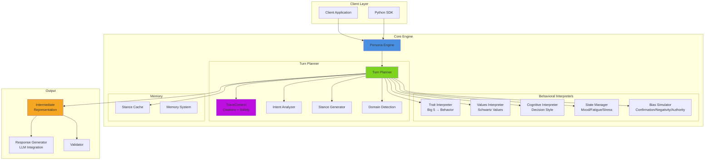
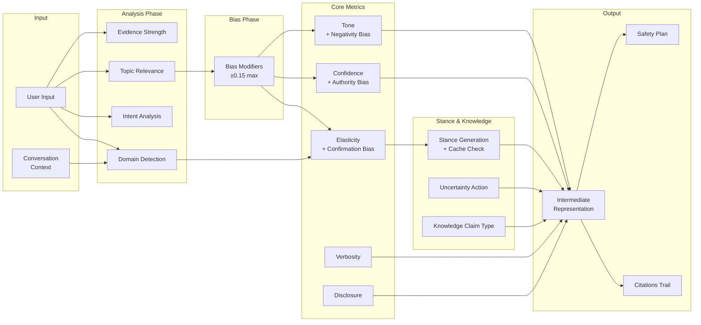
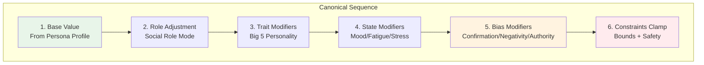
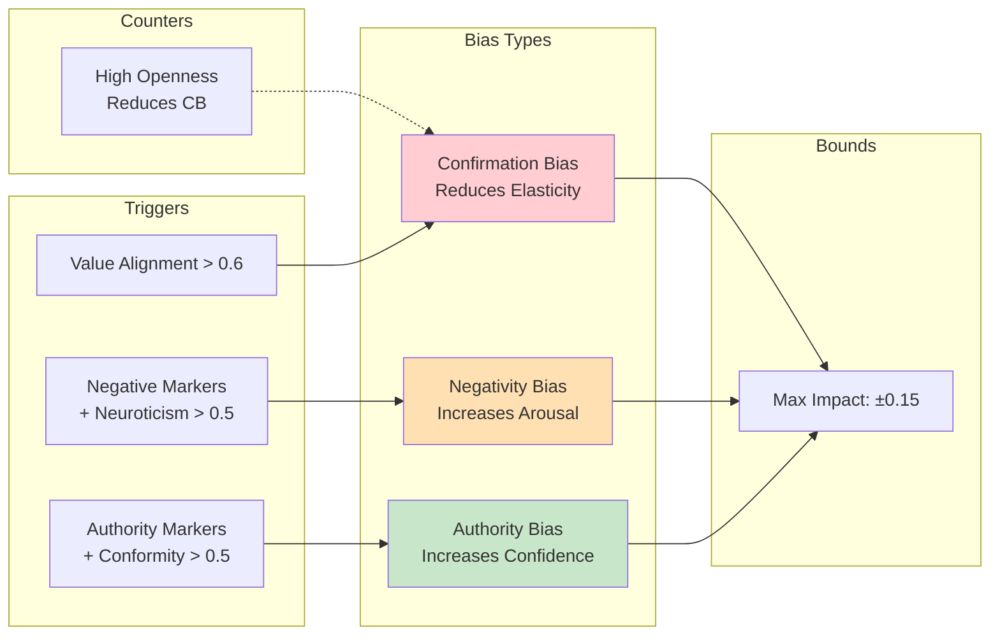
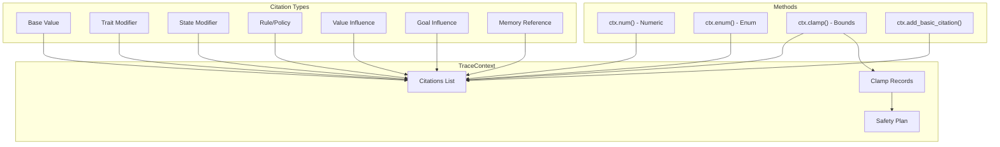

# Universal Conversational Persona System - Architecture

A psychologically-grounded persona engine that creates behaviorally coherent synthetic humans for testing, research, and simulation.

---

## System Overview



---

## Turn Planner Pipeline

The Turn Planner is the heart of the system. It orchestrates all behavioral interpreters to generate a complete IR with full citation trails.



---

## Modifier Composition Sequence

All IR parameters follow a canonical modifier sequence to prevent double-counting:



**Example: Elasticity Calculation**
```
elasticity = base(traits.elasticity)           # 0.60
          → blend(cognitive_complexity)         # 0.55
          → apply(confirmation_bias, -0.06)     # 0.49
          → clamp([0.1, 0.9])                   # 0.49 ✓
```

---

## Psychological Framework

```mermaid
graph TB
    subgraph "Personality (Big 5)"
        O[Openness<br/>Curiosity, creativity]
        C[Conscientiousness<br/>Organization, discipline]
        E[Extraversion<br/>Sociability, assertiveness]
        A[Agreeableness<br/>Compassion, cooperation]
        N[Neuroticism<br/>Emotional stability]
    end
    
    subgraph "Values (Schwartz)"
        SD[Self-Direction]
        ST[Stimulation]
        HE[Hedonism]
        AC[Achievement]
        PO[Power]
        SE[Security]
        CO[Conformity]
        TR[Tradition]
        BE[Benevolence]
        UN[Universalism]
    end
    
    subgraph "Cognitive Style"
        AN[Analytical vs Intuitive]
        RT[Risk Tolerance]
        NC[Need for Closure]
        CC[Cognitive Complexity]
    end
    
    subgraph "Dynamic State"
        MO[Mood<br/>Valence + Arousal]
        FA[Fatigue]
        STR[Stress]
        EN[Engagement]
    end
    
    subgraph "Behavioral Output"
        EL[Elasticity]
        CF[Confidence]
        TN[Tone]
        VB[Verbosity]
        DS[Disclosure]
        ST[Stance]
    end
    
    O --> EL
    C --> CF
    E --> VB
    A --> TN
    N --> STR
    
    CO --> CF
    TR --> CF
    SE --> CF
    
    N --> MO
    MO --> TN
    STR --> TN
    FA --> VB
    EN --> DS
    
    CC --> EL
    RT --> CF
    NC --> UA[Uncertainty Action]
```



---

## Bias Simulation (Phase 2)

Three bounded cognitive biases subtly influence persona behavior:



---

## Citation & Tracing System

Every decision is fully traceable via `TraceContext`:



---

## Package Structure

```
persona_engine/
├── schema/
│   ├── persona_schema.py     # Pydantic persona models
│   └── ir_schema.py          # IR models + citations
├── behavioral/
│   ├── trait_interpreter.py  # Big 5 → behavior
│   ├── values_interpreter.py # Schwartz values
│   ├── cognitive_interpreter.py
│   ├── state_manager.py      # Dynamic state
│   ├── rules_engine.py       # Decision policies
│   ├── bias_simulator.py     # Cognitive biases ← NEW
│   ├── uncertainty_resolver.py
│   └── constraint_safety.py
├── planner/
│   ├── turn_planner.py       # Core orchestration
│   ├── trace_context.py      # Citation tracking
│   ├── intent_analyzer.py    # User intent
│   ├── stance_generator.py   # Stance + rationale
│   └── domain_detection.py   # Topic detection
├── memory/
│   ├── stance_cache.py       # Stance consistency
│   └── fact_store.py         # Typed facts (Phase 4)
└── utils/
    └── determinism.py        # Seeded randomness
```

---

## Data Flow Summary

```
User Input
    │
    ▼
┌─────────────────────────────────────────────────┐
│                 Turn Planner                     │
│  ┌──────────┐  ┌──────────┐  ┌──────────┐       │
│  │ Domain   │  │ Intent   │  │ Evidence │       │
│  │ Detection│  │ Analysis │  │ Strength │       │
│  └────┬─────┘  └────┬─────┘  └────┬─────┘       │
│       │             │             │              │
│       ▼             ▼             ▼              │
│  ┌─────────────────────────────────────┐        │
│  │        Bias Modifiers (±0.15)       │        │
│  │  Confirmation │ Negativity │ Authority       │
│  └────────────────────┬────────────────┘        │
│                       │                          │
│       ┌───────────────┼───────────────┐         │
│       ▼               ▼               ▼         │
│  ┌─────────┐    ┌──────────┐    ┌─────────┐    │
│  │Elasticity│   │Confidence│    │  Tone   │    │
│  └─────────┘    └──────────┘    └─────────┘    │
│       │               │               │         │
│       └───────────────┴───────────────┘         │
│                       │                          │
│                       ▼                          │
│              ┌────────────────┐                  │
│              │ Assemble IR    │                  │
│              │ + Citations    │                  │
│              │ + Safety Plan  │                  │
│              └────────────────┘                  │
└─────────────────────────────────────────────────┘
                       │
                       ▼
            Intermediate Representation
                       │
                       ▼
              Response Generator (LLM)
                       │
                       ▼
                  Final Response
```

---

## Key Design Principles

1. **Single Source of Truth**: Each IR parameter computed by one authoritative process
2. **Canonical Modifier Sequence**: base → role → trait → state → bias → clamp
3. **Full Citation Trail**: Every decision traceable to source
4. **Bounded Biases**: Cognitive biases capped at ±0.15 impact
5. **Deterministic**: Seeded randomness for reproducible behavior
6. **Stance Consistency**: Cache prevents flip-flopping across turns

---

## Implementation Status

| Phase | Component | Status |
|-------|-----------|--------|
| 1 | Schema & Foundation | ✅ Complete |
| 2 | Behavioral Interpreters | ✅ Complete |
| 2 | Bias Simulation | ✅ Complete |
| 3 | Turn Planner | ✅ Complete |
| 3 | TraceContext & Citations | ✅ Complete |
| 4 | Memory System | 🔲 Planned |
| 5 | Response Generator | 🔲 Planned |
| 6 | Validation Suite | 🔲 Planned |
