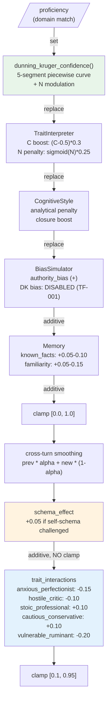
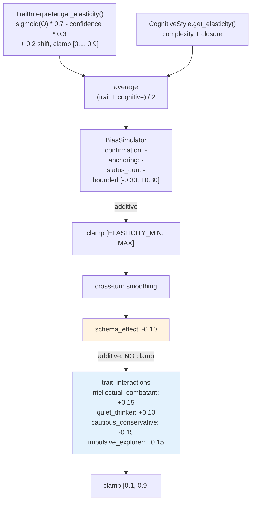
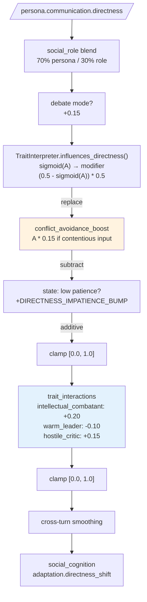
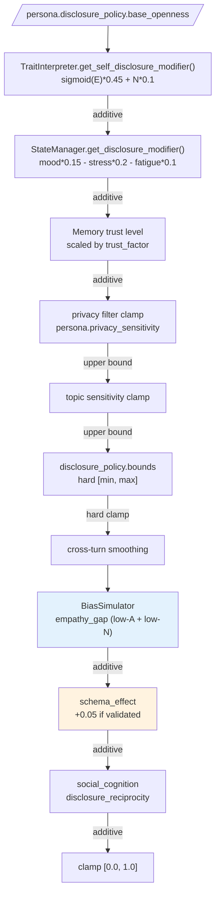
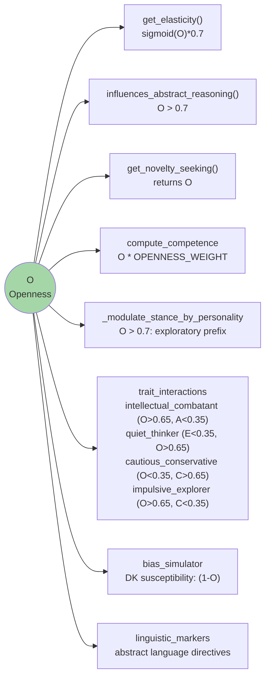
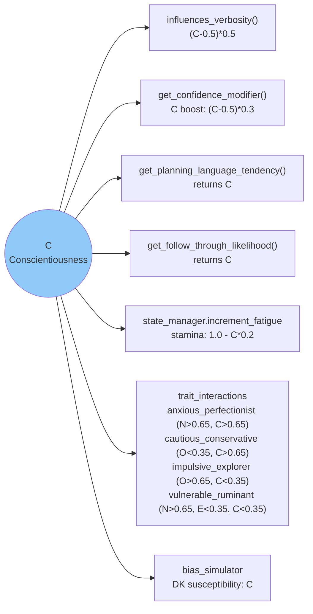
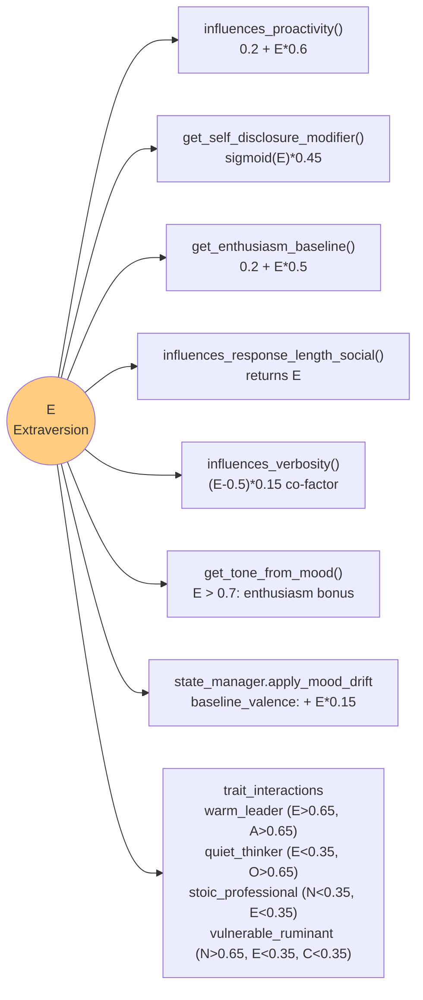
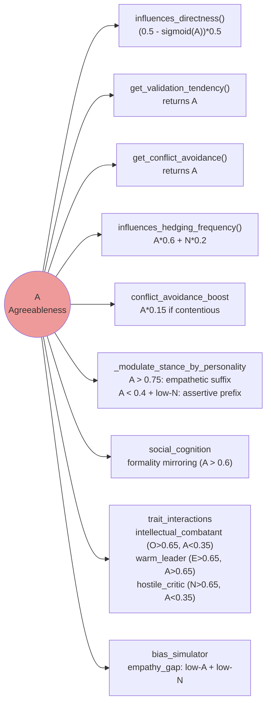
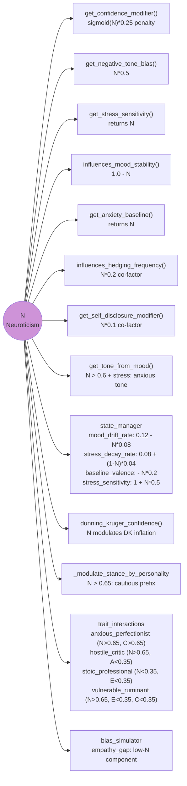

# Pipeline Flowcharts — Persona Engine IR Generation

> Generated 2026-03-20. Mermaid diagrams for the full pipeline, per-field modifier
> chains, and trait fan-out. Render in GitHub or any Mermaid-compatible viewer.

---

## 1. Master Pipeline

What flows between stages during `TurnPlanner.generate_ir()`.

```mermaid
flowchart TD
    INPUT[/"ConversationContext<br/>user_input, turn_number,<br/>interaction_mode, goal,<br/>topic_signature, stance_cache"/]

    subgraph S1["Stage 1: Foundation"]
        F1[Create TraceContext]
        F2[Generate turn_seed]
        F3[Build memory_context<br/>known_facts, preferences,<br/>previously_discussed]
    end

    subgraph S2["Stage 2: Interpretation"]
        I1[compute_topic_relevance]
        I2[analyze_intent<br/>mutates mode + goal]
        I3[detect_domain + proficiency]
        I4[check_decision_policy]
        I5[bias_simulator.compute_modifiers<br/>stores on planner._current_bias_modifiers]
        I6[expert_allowed =<br/>is_domain_specific AND<br/>proficiency >= threshold]
    end

    subgraph S3["Stage 3: Behavioral Metrics"]
        direction TB
        subgraph S3a["3a: Metrics"]
            M1[compute_elasticity<br/>trait + cognitive + bias]
            M2[compute_confidence<br/>DK curve + trait + cognitive + bias + memory]
            M3[compute_competence<br/>domain match + openness + memory]
        end
        subgraph S3b["3b: Guidance"]
            G1[generate_stance<br/>cache check → stance_generator]
            G2[compute_trait_guidance<br/>hedging, enthusiasm, validation,<br/>conflict_avoidance, neg_tone]
            G3[compute_cognitive_guidance<br/>reasoning_style, rationale_depth,<br/>nuance_level]
        end
        subgraph S3c["3c: Style"]
            ST1[select_tone<br/>mood + stress + enthusiasm + bias → Tone enum]
            ST2[compute_verbosity<br/>base + C/E trait + state override]
            ST3[compute_communication_style<br/>formality + directness<br/>role blend + trait + state]
        end
        subgraph S3d["3d: Modulation"]
            EM[emotional_appraisal<br/>detect emotion → appraise → update mood]
            SC[social_cognition<br/>user model → adaptation + schema effect]
            TI[trait_interactions<br/>9 patterns → aggregate modifiers<br/>confidence, elasticity, directness,<br/>hedging, enthusiasm, neg_tone]
        end
    end

    subgraph S4["Stage 4: Knowledge & Safety"]
        K1[compute_disclosure<br/>base + trait + state + trust<br/>+ privacy + policy + bias + schema]
        K2[resolve_uncertainty_action<br/>proficiency + confidence +<br/>risk_tolerance + closure + stress]
        K3[infer_knowledge_claim_type<br/>proficiency + uncertainty +<br/>personal_experience + domain]
        K4[validate_stance_against_invariants]
    end

    subgraph S5["Stage 5: Finalization"]
        FN1[Build memory read/write ops]
        FN2[Propagate safety plan<br/>cannot_claim, must_avoid]
        FN3[Collect behavioral_directives<br/>trait + cognitive + adaptation + schema]
        FN4[build_personality_language_directives<br/>LIWC markers, emotional coloring]
        FN5[Assemble IR]
        FN6[Cache stance + store snapshot<br/>+ process memory writes]
    end

    POST[/"evolve_state_post_turn<br/>mood drift, fatigue, stress decay,<br/>engagement, noise"/]

    OUTPUT[/"IntermediateRepresentation<br/>conversation_frame, response_structure,<br/>communication_style, knowledge_disclosure,<br/>citations, safety_plan, memory_ops,<br/>behavioral_directives, personality_language"/]

    INPUT --> S1
    S1 -->|"TraceContext, turn_seed,<br/>MemoryOps, memory_context"| S2
    S2 -->|"InterpretationResult<br/>topic_relevance, domain, proficiency,<br/>expert_allowed, user_intent,<br/>bias_modifiers on planner"| S3
    S3 -->|"BehavioralMetricsResult<br/>elasticity, stance, confidence,<br/>competence, tone, verbosity,<br/>formality, directness,<br/>trait/cognitive guidance,<br/>adaptation, schema_effect"| S4
    S4 -->|"KnowledgeSafetyResult<br/>disclosure_level,<br/>uncertainty_action,<br/>claim_type"| S5
    S5 --> OUTPUT
    OUTPUT --> POST
```

---

## 2. Per-Field Modifier Chains

The 4 most complex IR fields. Each box shows source → operation → effect.

### 2a. Confidence

### 2b. Elasticity

### 2c. Directness

### 2d. Disclosure

---

## 3. Trait Fan-Out

Where each Big Five trait is consumed across the pipeline.

### 3a. Openness (O)

### 3b. Conscientiousness (C)

### 3c. Extraversion (E)

### 3d. Agreeableness (A)

### 3e. Neuroticism (N)

---

## Color Legend

- Green boxes: trait-based computation (individual trait effect)
- Blue boxes: interaction/bias modifiers (emergent or cognitive bias effects)
- Orange boxes: unclamped intermediate values (potential out-of-bounds, see TF-002/003/004)
- Purple/colored trait nodes: the Big Five trait being traced

---

## How to Use These Diagrams

1. **Debugging:** When an IR field has an unexpected value, follow its modifier chain top-to-bottom. Each box shows the formula and operation.
2. **Double-counting check:** If the same trait node appears in both a per-field chain AND an interaction pattern targeting the same field, verify the combined effect is intentional.
3. **Clamp analysis:** Orange boxes mark unclamped gaps. If a value goes out of expected range, check if it passes through an orange box.
4. **Adding new modifiers:** Before adding a new trait influence on any field, check the fan-out diagram to see what already touches that field.
